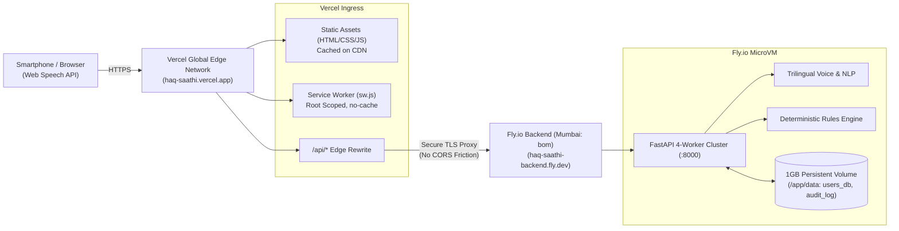

# 🌐 Deploying Haq Saathi: Vercel (Frontend) + Fly.io (Backend)

This guide walks you through deploying the **React 18 PWA frontend on Vercel** and the **FastAPI backend on Fly.io** with persistent storage in Mumbai (India).

---

## 🏛️ Split Architecture Overview



---

## 🚀 Part 1: Deploy Backend to Fly.io

### 1. Install Fly CLI
- **macOS / Linux:**
  ```bash
  curl -L https://fly.io/install.sh | sh
  ```
- **Windows (PowerShell):**
  ```powershell
  iwr https://fly.io/install.ps1 -useb | iex
  ```

### 2. Sign In to Fly.io
```bash
fly auth login
```

### 3. Launch & Create Persistent Storage
Run the automated script:
- **Linux/macOS:**
  ```bash
  chmod +x scripts/deploy_fly.sh
  ./scripts/deploy_fly.sh
  ```
- **Windows (PowerShell):**
  ```powershell
  .\scripts\deploy_fly.ps1
  ```

*Or manually:*
```bash
# 1. Create a 1GB persistent volume in Mumbai (bom)
fly volumes create haq_saathi_data --size 1 --region bom -a haq-saathi-backend --yes

# 2. Deploy the container
fly deploy
```

### 4. Verify Backend Health
Visit your Fly backend URL:
- **Schemes API:** `https://haq-saathi-backend.fly.dev/api/schemes`
- **Swagger Docs:** `https://haq-saathi-backend.fly.dev/docs`

---

## ⚡ Part 2: Deploy Frontend to Vercel

### Method A: Connect GitHub to Vercel (Easiest & Automatic CI/CD)
1. Go to [vercel.com](https://vercel.com) and log in with GitHub.
2. Click **"Add New..."** $\to$ **"Project"**.
3. Import your repository: **`shamithanaiga-gif/Haq_sathi`**.
4. Configure Project Settings:
   - **Framework Preset:** `Other`
   - **Root Directory:** `./`
   - **Build Command:** Leave blank
   - **Output Directory:** Leave blank (handled automatically by `vercel.json`)
5. Click **"Deploy"**.

### Method B: Deploy via Vercel CLI
```bash
# Run deployment script (uses npx, zero installation required)
npm run deploy:vercel
# Or directly:
npx vercel --prod
```

---

## 🔗 Part 3: Connecting Frontend to Backend

In [vercel.json](file:///c:/Users/shrey/Downloads/final/vercel.json), the `/api/*` route is automatically rewritten to your Fly.io backend:

```json
{
  "rewrites": [
    {
      "source": "/api/:path*",
      "destination": "https://haq-saathi-backend.fly.dev/api/:path*"
    }
  ]
}
```

> [!NOTE]
> If your Fly.io app name is different from `haq-saathi-backend`, simply replace `haq-saathi-backend` in `vercel.json` with your actual app name and re-deploy to Vercel (`npx vercel --prod`).

---

## 🧪 Post-Deployment Verification

1. Open your Vercel deployment URL (e.g. `https://haq-saathi.vercel.app`) on your mobile smartphone.
2. **Microphone Access**: Tap the mic button — voice recognition in Kannada, Hindi, and English will prompt for permission without security warnings.
3. **PWA Offline & Install**: Confirm the "Add to Home Screen" or "Install App" banner activates.
4. **Data Persistence**: Log in with phone `9876543210`, submit a test scheme application, and refresh — data is safely stored in Fly.io's persistent volume!
