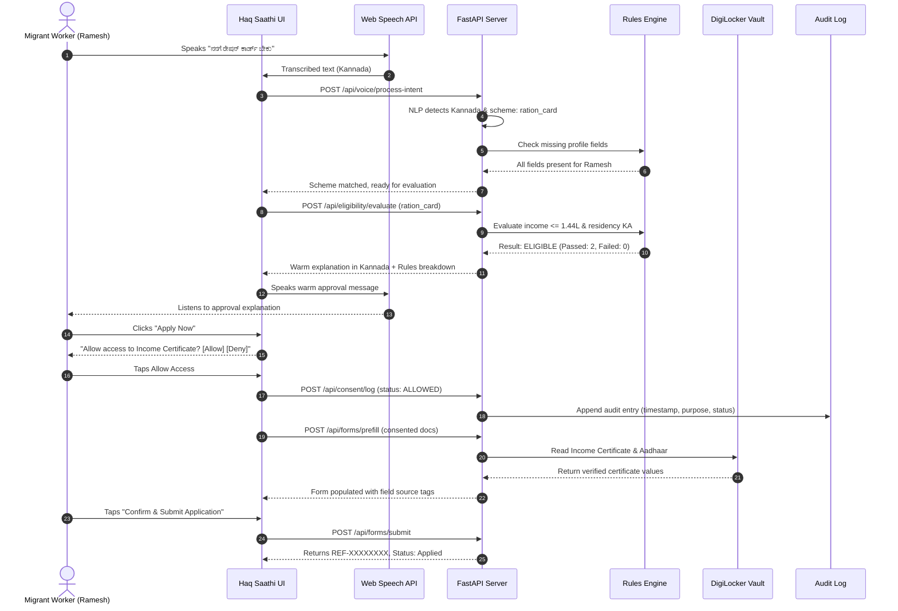
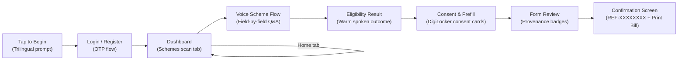

# 🏛️ Haq Saathi (ಹಕ್ಕು ಸಾಥಿ): Comprehensive Project Report
### A Voice-First, Consent-Based Entitlement Navigator for Migrant Workers

> **Last Updated**: 27 September 2026 · Backend: `main.py` (29 KB), `nlp_service.py` (34 KB), `rules_engine.py` (16 KB) · Frontend: `app.js` (209 KB) · Server: Running on `http://127.0.0.1:8000`

---

## 1. Executive Summary

### 1.1 Problem Statement
India has over **450 million internal migrants**, millions of whom work as daily-wage labourers in urban centres like Bengaluru. Migrant workers frequently miss out on critical social welfare benefits—including subsidized food grains, tertiary healthcare, children's educational scholarships, and social security pensions—due to four structural obstacles:
1. **Linguistic & Literacy Barriers**: Application forms and government portals use formal, Sanskritized administrative Kannada or English, creating steep cognitive friction for low-literacy or dialect-speaking workers (e.g., North Karnataka dialects).
2. **Exploitative Intermediaries ("Brokers/Middlemen")**: Due to system opacity, workers often pay substantial portions of their wages or benefits to predatory agents for filling out applications.
3. **Lack of Granular Data Consent**: Workers are routinely asked to hand over physical originals of their Aadhaar cards, passbooks, and caste certificates without transparency regarding who sees their data or how long it is stored.
4. **Opaque Eligibility Decisions**: Rejections often lack actionable explanations, leaving workers unaware of whether an error was due to an income ceiling, missing paperwork, or age criteria.

### 1.2 The Haq Saathi Solution
**Haq Saathi** (*"Companion for Rights"*) is an accessible, voice-first progressive web application built to navigate welfare entitlements with dignity and transparency:
- **Voice-First in Native Tongue**: Beneficiaries speak naturally in Kannada, Hindi, or English using browser-native Web Speech recognition.
- **Deterministic Zero-LLM Eligibility Decisions**: Eligibility is evaluated strictly by a deterministic JSON Rules Engine—**never by an LLM**—eliminating algorithmic hallucinations and bias.
- **Step-by-Step Colloquial Guidance**: Missing requirements are requested one at a time, with simple voice explanations for complex terms like *"Annual Family Income"* or *"BOCW Labour Card"*.
- **DigiLocker Consent Vault**: Eliminates camera uploads or document scans. Documents are retrieved from a simulated DigiLocker vault only upon explicit, granular consent.
- **Revocable Audit Trail**: An immutable audit log records every document access event and empowers the user to revoke consent at any moment.
- **Available Schemes Voice Query**: Users can ask "what schemes are available for me?" in English, Kannada, or Hindi to trigger a spoken readout of their eligible schemes.

---

## 2. System Architecture & Information Flow

The architecture decouples conversational interaction from official policy rules, ensuring that AI enhances usability without compromising decision integrity.

### 2.1 Architecture Diagram

```mermaid
flowchart TD
    subgraph Client["Frontend Layer (React 18 + PWA)"]
        UI["Mobile-First UI (Kannada / Hindi / English)"]
        STT["Web Speech Recognition (kn-IN / hi-IN / en-IN)"]
        TTS["Web Speech Synthesis (Vocal Feedback)"]
        AuditUI["Consent Audit Dashboard (Revocation Controls)"]
        HomeNav["Home Navigation (Tab Bar)"]
    end

    subgraph API["Backend Layer (FastAPI / Python)"]
        Server["FastAPI Router & Endpoints"]
        NLP["NLP Service (Intent Extraction, Trilingual Term Clarifier, Available-Schemes Detector)"]
        RE["Pure Deterministic Rules Engine (JSON Logic)"]
        VS["Vault Service (DigiLocker & Form Prefiller)"]
        Auth["Auth Service (OTP, Session Tokens, Multi-User DB)"]
    end

    subgraph Storage["Data Store (Local Mock Database)"]
        DB_Users[("users_db.json (Multi-user)")]
        DB_Schemes[("schemes_rules.json")]
        DB_Templates[("form_templates.json")]
        DB_Vault[("mock_document_vault.json")]
        DB_Audit[("audit_log.json")]
        DB_Sessions[("active_sessions.json")]
    end

    STT -->|"Spoken Utterance"| UI
    UI -->|"POST /api/voice/process-intent"| Server
    Server --> NLP
    NLP -->|"Extract Entities, Target Scheme, Available-Schemes Flag"| Server
    Server <-->|"Check Missing Fields"| DB_Schemes
    Server -->|"Next Question Prompt"| TTS

    UI -->|"POST /api/eligibility/evaluate"| Server
    Server --> RE
    RE -->|"Evaluate Deterministic Criteria"| DB_Schemes
    RE <--> DB_Users
    RE -->|"Raw Rules Result"| NLP
    NLP -->|"Warm Conversational Rephrasing"| UI
    UI -->|"Read Aloud Decision"| TTS

    UI -->|"POST /api/auth/otp/generate"| Auth
    Auth --> DB_Users
    Auth --> DB_Sessions

    UI -->|"POST /api/consent/log (ALLOW/DENY)"| Server
    Server --> VS
    VS -->|"Log Event"| DB_Audit
    VS <-->|"Fetch Consented Documents"| DB_Vault
    VS <-->|"Merge Form Template"| DB_Templates
    VS -->|"Prefilled Form with Provenance Badges"| UI
    AuditUI -->|"POST /api/consent/revoke"| Server
    Server -->|"Mark Revoked"| DB_Audit
```



### 2.2 End-to-End Sequence of Operations



---

## 3. Technology Stack & Frameworks

| Component | Technology | Rationale |
|---|---|---|
| **Frontend Framework** | **React 18** (SPA, browser runtime) | Declarative state management for real-time speech states, multi-step consent modals, and reactive audio visualizer. Zero build step — loaded via CDN. |
| **Speech-to-Text (STT)** | **Web Speech API** (`SpeechRecognition`) | Zero-latency, browser-native recognition supporting `kn-IN`, `hi-IN`, and `en-IN` without audio blobs or external APIs. |
| **Text-to-Speech (TTS)** | **Web Speech API** (`SpeechSynthesis`) | Native vocalization with configurable rate (0.95x) and pitch for low-literacy clarity. Selects localized voice engines dynamically. |
| **PWA Infrastructure** | **Service Worker + Web Manifest** | Offline asset caching, standalone full-screen mobile installation, home screen launch. |
| **Styling & UI** | **Custom CSS3 + CSS Variables** | Accessible color palette (Emerald `#059669`, Warm Amber `#d97706`), large touch targets (min 48px), audio pulse animation. |
| **Backend Framework** | **Python FastAPI + Uvicorn** | High-performance async REST API with Pydantic schema validation and self-documenting OpenAPI. |
| **Rules Engine** | **Pure Python Logic (`rules_engine.py`)** | Deterministic, auditable if/else engine based on JSON rule definitions — zero LLM involvement. |
| **Database** | **`users_db.json` (Multi-user JSON store)** | Persistent multi-user store with OTP auth, session tokens, application history, vault permissions, and per-user audit log separation. |
| **Mock Data** | **Structured JSON Files (`/data`)** | `schemes_rules.json`, `form_templates.json`, `mock_document_vault.json`, `audit_log.json`, `active_sessions.json`. |

---

## 4. Detailed Component & Logic Breakdown

### 4.1 Pure Deterministic Rules Engine ([`backend/rules_engine.py`](file:///C:/Users/vinee/.gemini/antigravity/scratch/haq-saathi/backend/rules_engine.py))

> [!IMPORTANT]
> **Strict Policy**: An LLM is never permitted to evaluate, interpret, or decide scheme eligibility. All rules are evaluated through pure, auditable logic.

`evaluate_scheme_eligibility(scheme, user_data)` evaluates each rule condition:
1. **Residency Check (`state_resident`)** → $$\text{Result} = (\text{user.state\_resident} == \text{rule.state\_resident})$$
2. **Income Ceiling Check (`annual_income_max`)** → $$\text{Income} = \text{user.annual\_income} \text{ or } (\text{user.monthly\_income} \times 12)$$
   $$\text{Condition}: \text{Income} \le \text{rule.annual\_income\_max}$$
3. **Age Requirement Check (`min_age`)** → $$\text{Condition}: \text{user.age} \ge \text{rule.min\_age}$$
4. **Occupation Classification (`occupation`)** → synonyms set `{construction_worker, mason, labourer, building_worker, coolie}`
5. **Welfare Board Registration (`has_labour_card`)** → $$\text{Condition}: \text{user.has\_labour\_card} == \text{True}$$
6. **School Attendance (`has_school_going_child`)** → $$\text{Condition}: \text{user.has\_school\_going\_child} == \text{True}$$

`check_all_scheme_eligibility(schemes, user_data, lang)` scans all 4 schemes and returns:
- `eligible`, `needs_more_info`, `not_eligible` lists
- `summary`, `summary_en`, `summary_kn`, `summary_hi` — trilingual spoken summaries naming each category by friendly name

---

### 4.2 NLP Service & Trilingual Explainer ([`backend/nlp_service.py`](file:///C:/Users/vinee/.gemini/antigravity/scratch/haq-saathi/backend/nlp_service.py))

Four distinct roles:
1. **Language Detection & Intent Extraction** — detects Kannada, Hindi, English and extracts fields.
2. **Available Schemes Query Detection** *(latest feature)* — detects 50+ multilingual phrasings and sets `scheme_interest = "all"`.
3. **Colloquial Term Clarifications** — explains government terms in EN/KN/HI.
4. **Warm Decision Rephrasing** — converts raw boolean output to respectful phrasing.

**Scope Guard:** blocks off‑topic, handles parse failures, but never blocks the available‑schemes query.

---

### 4.3 Mock DigiLocker Vault & Consent Manager ([`backend/vault_service.py`](file:///C:/Users/vinee/.gemini/antigravity/scratch/haq-saathi/backend/vault_service.py))
- No file uploads, per‑document consent, provenance tags, revocation.

---

### 4.4 Multi-User Authentication & Account System ([`backend/user_store.py`](file:///C:/Users/vinee/.gemini/antigravity/scratch/haq-saathi/backend/user_store.py))
- OTP login, session tokens, per‑user isolation, dependents, idempotent reference IDs.

---

### 4.5 FastAPI REST Server ([`backend/main.py`](file:///C:/Users/vinee/.gemini/antigravity/scratch/haq-saathi/backend/main.py))
**Full API Surface (24 endpoints)**
| Method | Route | Purpose |
|---|---|---|
| POST | `/api/auth/otp/generate` | Generate OTP |
| POST | `/api/auth/otp/verify` | Verify OTP, issue session token |
| POST | `/api/auth/register` | Register new user |
| GET | `/api/user/dashboard` | Full dashboard (schemes scan, apps, vault, audit) |
| POST | `/api/user/field` | Save a profile field |
| GET | `/api/user/field` | Get a profile field |
| POST | `/api/user/dependents` | Add a dependent |
| POST | `/api/user/documents/toggle` | Toggle vault permission |
| POST | `/api/schemes/scan-all` | Scan eligibility across all schemes |
| GET | `/api/schemes` | List all schemes |
| GET | `/api/profile` | Get legacy seed profile |
| POST | `/api/profile/update` | Update profile fields |
| POST | `/api/profile/reset` | Reset profiles to seed data |
| POST | `/api/voice/process-intent` | NLP intent parsing + routing |
| POST | `/api/eligibility/evaluate` | Deterministic eligibility evaluation |
| GET | `/api/vault/documents` | Get vault documents |
| POST | `/api/consent/log` | Log consent action |
| GET | `/api/consent/audit-log` | Get audit log |
| POST | `/api/consent/revoke` | Revoke consent |
| POST | `/api/forms/prefill` | Prefill form from vault docs |
| POST | `/api/forms/submit` | Submit application, generate idempotent Reference ID |
| POST | `/api/application/status` | Update application status |
| GET | `/api/application/status` | Get application status |
| GET | `/` | Serve frontend index.html |

---

### 4.6 Frontend Application ([`frontend/js/app.js`](file:///C:/Users/vinee/.gemini/antigravity/scratch/haq-saathi/frontend/js/app.js))
**~3,982 lines of React 18**
#### Screen Flow Diagram

#### Key State Variables
| State | Type | Purpose |
|---|---|---|
| `lang` | `'kn' \| 'hi' \| 'en'` | Active language |
| `currentUser` | Object | Authenticated profile |
| `currentScreen` | String | `login \| register \| dashboard \| scheme_flow` |
| `activeTab` | String | `schemes \| profile \| applications \| documents \| activity` |
| `scanResults` | Object | Live eligibility scan results |
| `activeScheme` | Object | Currently active scheme |
| `conversationLog` | Array | Voice transcript |
| `submittedApp` | Object | Last submitted application |
| `printReceiptApp` | Object | Application selected for print bill |
#### Key Handler Functions
| Function | Description |
|---|---|
| `handleUniversalVoiceRouter` | Dispatches top‑level mic results when no scheme flow is active |
| `handleSchemeFieldAnswer` | Processes voice answer for a field mid‑flow |
| `handleStartSchemeFlow` | Initiates voice application for a chosen scheme |
| `handleConsentAction` | Logs ALLOW/DENY consent for a document type |
| `handleSubmitApplication` | Submits form, stores idempotent reference ID |
| `handleOpenPrintBill` | Opens print‑ready A4 receipt |
| `speakAndListen` | Core TTS→STT handoff |
| `loadDashboard` | Fetches dashboard data on login |

---

## 5. Seeded Beneficiary Profile & Scheme Rulebook
### 5.1 Seeded Profile: Ramesh Naik
- **Name**: Ramesh Naik (ರಮೇಶ್ ನಾಯ್ಕ್) | **Phone**: `9876543210`
- **Age**: 32 | **Occupation**: Construction worker / mason
- **Monthly Income**: ₹12,000 (Annual: ₹1,44,000) | **Household**: 4 members
- **Children**: 1 school‑going son (Class 4)
- **Board Registration**: Active BOCW Labour Card (`KA-BOCW-2022-847291`)
- **Bank**: DBT‑enabled SBI account (`3948XXXX482`)

### 5.2 The 4 Government Schemes & Evaluation Outcomes
| Scheme ID | Scheme Name | Key Criteria | Outcome | Rationale |
|---|---|---|:---:|---|
| `ration_card` | Karnataka Ahara BPL Ration Card | Income ≤ ₹1,44,000, KA Resident | ✅ **ELIGIBLE** | Income at ceiling; resides in Bengaluru |
| `health_cover` | Ayushman Bharat – Arogya Karnataka | Income ≤ ₹1,80,000, KA Resident | ✅ **ELIGIBLE** | Category A — free cashless treatment up to ₹5 L/year |
| `child_scholarship` | BOCW Pre‑Matric Child Scholarship | Construction worker, Labour Card, school child | ✅ **ELIGIBLE** | Active BOCW card, child in Class 4 — ₹3K–₹10K/year DBT |
| `pension` | Sandhya Suraksha Senior Pension | Age ≥ 65, Income ≤ ₹20,000 | ❌ **NOT ELIGIBLE** | Age 32 — fails minimum age 65. Transparent rejection. |

---

## 6. Features Implemented (Cumulative)
### 6.1 Core Eligibility & Voice Engine
- Deterministic rules engine (zero LLM)
- Voice‑guided field collection (one field at a time)
- Trilingual NLP parsing (EN, KN, HI)
- Income extraction, occupation synonym matching, boolean detection
- Out‑of‑scope refusal, parse‑failure recovery, term clarification

### 6.2 Authentication & Multi‑User System
- OTP login, session tokens, cross‑user access prevention
- User registration with masked Aadhaar, DigiLocker link
- Per‑user data isolation, dependents, idempotent reference IDs

### 6.3 Consent & DigiLocker Vault
- Granular per‑document consent, provenance tags, revocation
- Audit log, vault permission sync

### 6.4 Application Submission & Tracking
- Idempotent `reference_id`
- Confirmation screen with `REF-XXXXXXXX` and status stepper
- Printable A4 bill/receipt
- Application history tab, proxy applications

### 6.5 UI & Accessibility
- Trilingual language selection with “Tap to begin” gate
- Spoken trilingual welcome prompt
- Home button navigation (`navigate("/")`)
- Conversation transcript display, audio pulse animation, mobile‑first touch targets, PWA support

### 6.6 Available Schemes Voice Query *(latest feature)*
- NLP detects 50+ phrasings across EN/KN/HI
- Backend runs `check_all_scheme_eligibility` and returns trilingual `spoken_summary`
- Frontend switches to Schemes tab and reads out the summary via TTS

---

## 7. Verification & Test Suite
| Test File | Scope | Result |
|---|---|---|
| `test_e2e.py` | Original 10‑step API suite | ✅ 10/10 |
| `test_backend.py` | Backend unit tests (rules engine, NLP, vault) | ✅ Pass |
| `test_section10_e2e.py` | Integration & security (Aadhaar masking, session auth, cross‑user) | ✅ 10/10 |
| `test_section11_e2e.py` | Full Section 11 voice flow verification | ✅ 10/10 |
| `test_five_bug_fixes.py` | Voice input display, matching, parse failure, out‑of‑scope, language switch | ✅ Pass |
| `test_application_print_and_tracking.py` | Print bill, reference ID idempotency, status stepper | ✅ Pass |
| `test_browser_home_nav.py` | Home button navigation regression | ✅ Pass |
| `test_voice_reg_and_lang.py` | Voice registration and mid‑session language switch | ✅ Pass |

---

## 8. Security, Privacy & Data Sovereignty
1. **Principle of Least Privilege** – documents accessed only on demand.
2. **Proof of Provenance** – every prefilled field shows its source.
3. **One‑Tap Revocability** – revoking consent marks audit `REVOKED` and halts reuse.
4. **No Real PII Exposure** – mock data uses masked Aadhaar, PAN.
5. **Session Token Authorization** – `X-Session-Token` validated on every user‑scoped endpoint (HTTP 403 on mismatch).
6. **Cross‑User Access Prevention** – cleaned phone numbers + session owner verification.

---

## 9. Summary of All Project Files
### Backend
| File | Size | Purpose |
|---|---|---|
| `backend/main.py` | 29 KB | FastAPI server – 24 endpoints, OTP auth, forms, static serve |
| `backend/nlp_service.py` | 34 KB | Trilingual NLP parser, available‑schemes detector, term clarifier |
| `backend/rules_engine.py` | 16 KB | Deterministic eligibility evaluator + all‑scheme scanner |
| `backend/vault_service.py` | 7.6 KB | DigiLocker vault, consent logger, form assembler |
| `backend/user_store.py` | 24 KB | Multi‑user DB, OTP, sessions, dependents, idempotent IDs |

### Frontend
| File | Size | Purpose |
|---|---|---|
| `frontend/js/app.js` | 209 KB | React SPA – full voice flow, auth, dashboard, schemes, consent, print |
| `frontend/js/api.js` | 6.6 KB | Typed API client |
| `frontend/js/voice.js` | 11.7 KB | Web Speech abstraction (STT/TTS) |
| `frontend/js/i18n.js` | 49.9 KB | Trilingual UI strings |
| `frontend/css/style.css` | 28.7 KB | Accessible design, audio pulse, stepper, print layout |
| `frontend/index.html` | 1.9 KB | App shell with PWA tags |
| `frontend/manifest.json` | 0.5 KB | PWA manifest |
| `frontend/sw.js` | 1.1 KB | Service worker for offline caching |

### Data
| File | Size | Purpose |
|---|---|---|
| `data/users_db.json` | 231 KB | Multi‑user store (profiles, apps, vault, audit) |
| `data/schemes_rules.json` | 30 KB | Core eligibility rules |
| `data/form_templates.json` | 12 KB | Form schemas mapping inputs |
| `data/mock_document_vault.json` | 4.2 KB | Sandbox DigiLocker documents |
| `data/audit_log.json` | 59 KB | Append‑only consent log |
| `data/active_sessions.json` | 0.9 KB | Active session tokens |

### Tests
| File | Purpose |
|---|---|
| `test_section11_e2e.py` | Full voice flow verification |
| `test_section10_e2e.py` | Integration & security suite |
| `test_application_print_and_tracking.py` | Print bill, reference ID, status stepper |
| `test_browser_home_nav.py` | Home button navigation regression |
| `test_five_bug_fixes.py` | Voice input display, matching, parse failure, out‑of‑scope, language switch |
| `test_voice_reg_and_lang.py` | Voice registration & language switch |
| `test_e2e.py` | Original API suite |
| `test_backend.py` | Backend unit tests |

### Infrastructure
| File | Purpose |
|---|---|
| `run.py` | Server bootstrap (`uvicorn backend.main:app`) |
| `.vscode/launch.json` | VS Code debug configuration |
| `.vscode/tasks.json` | VS Code task runner |

---

## 10. Running the Project
```bash
# From workspace root
# C:\Users\vinee\.gemini\antigravity\scratch\haq-saathi

# Start the server
python run.py

# Open in browser
# http://127.0.0.1:8000

# Run API tests (server must be running)
python test_e2e.py
python test_section10_e2e.py

# API docs
# http://127.0.0.1:8000/docs
```

> [!TIP]
> After editing backend files, kill the running task (`task-2627`) and restart the server for changes to take effect.

---

*End of Report*
