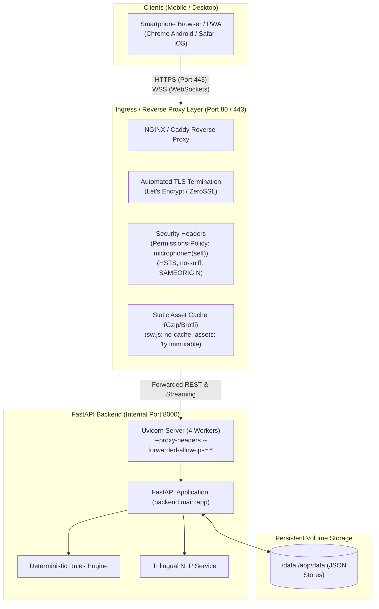

# 🔒 Haq Saathi — HTTPS, TLS Ingress & Mobile Testing Guide

This guide details the production and local HTTPS infrastructure for **Haq Saathi (ಹಕ್ಕು ಸಾಥಿ)**.

---

## 1. Why HTTPS is Mandatory

1. **Web Speech API (`SpeechRecognition` & `SpeechSynthesis`)**: Modern mobile and desktop browsers (Google Chrome on Android, Apple Safari on iOS) **strictly enforce** that microphone recording and audio capture APIs are available **only in secure contexts (`https://`)** or on `localhost`. Remote LAN IP access (e.g. `http://192.168.1.X:8000`) is blocked by browser security sandboxes.
2. **PWA Service Worker (`frontend/sw.js`)**: Service workers require `https://` origins to install, cache offline assets, and display the native *"Add to Home Screen"* install prompt.
3. **Sensitive Welfare Data & Consent Protection**: Session tokens (`X-Session-Token`), OTP verification payloads, masked identity identifiers, and DigiLocker consent logs require end-to-end TLS 1.3 encryption in transit.

---

## 2. Architecture Overview



---

## 3. Production Deployment Options

### Option A: NGINX + Certbot Automated Let's Encrypt (Default)

#### Files:
- [`Dockerfile`](file:///c:/Users/shrey/Downloads/final/Dockerfile) — Containerizes FastAPI backend with 4 Uvicorn workers.
- [`docker-compose.prod.yml`](file:///c:/Users/shrey/Downloads/final/docker-compose.prod.yml) — Orchestrates `web`, `proxy` (NGINX), and `certbot`.
- [`nginx/nginx.conf`](file:///c:/Users/shrey/Downloads/final/nginx/nginx.conf) — Global performance tuning and Gzip compression.
- [`nginx/conf.d/haq_saathi.conf`](file:///c:/Users/shrey/Downloads/final/nginx/conf.d/haq_saathi.conf) — Virtual host with TLS 1.3, security headers, static caching, and proxy pass.
- [`scripts/init_letsencrypt.sh`](file:///c:/Users/shrey/Downloads/final/scripts/init_letsencrypt.sh) — Initial certificate bootstrap script.

#### Launch Steps:
```bash
# 1. Copy environment template and configure your domain
cp .env.example .env
nano .env  # Set DOMAIN=haqsaathi.org and LETSENCRYPT_EMAIL=admin@haqsaathi.org

# 2. Bootstrap Let's Encrypt certificates (solves initial NGINX startup cycle)
chmod +x scripts/init_letsencrypt.sh
./scripts/init_letsencrypt.sh

# 3. View live production logs
docker compose -f docker-compose.prod.yml logs -f
```

---

### Option B: Caddy Server (Zero-Configuration HTTPS)

Caddy automatically provisions, configures, and renews TLS certificates via Let's Encrypt / ZeroSSL with zero manual certbot configuration.

#### Files:
- [`Caddyfile`](file:///c:/Users/shrey/Downloads/final/Caddyfile) — Automated HTTPS ingress definition with security headers and static asset handling.
- [`docker-compose.caddy.yml`](file:///c:/Users/shrey/Downloads/final/docker-compose.caddy.yml) — 2-service compose setup (`web` + `caddy`).

#### Launch Steps:
```bash
# 1. Set environment variables
export DOMAIN="haqsaathi.org"
export LETSENCRYPT_EMAIL="admin@haqsaathi.org"

# 2. Start stack
docker compose -f docker-compose.caddy.yml up -d
```

---

## 4. Local LAN & Mobile Device Testing (Zero-Domain Setup)

To test the Web Speech API on **physical smartphones (Android/iOS)** without purchasing a domain or configuring public DNS, use the included [`run_local_https.py`](file:///c:/Users/shrey/Downloads/final/run_local_https.py) helper utility.

### Mode 1: Cloudflare Quick Tunnel (Recommended)
Generates an instant, publicly accessible HTTPS endpoint backed by Cloudflare's globally trusted CA certificates:
```bash
python run_local_https.py --mode tunnel
```
Or via script:
- **Linux/macOS:** `./scripts/run_tunnel.sh`
- **Windows PowerShell:** `.\scripts\run_tunnel.ps1`

**Why this is best for mobile:**
- Zero account, zero sign-up, zero configuration required.
- Produces a secure URL like `https://xyz-random.trycloudflare.com`.
- Mobile Chrome and Safari immediately trust the certificate and prompt for **Microphone permission** on the first user interaction.

### Mode 2: Local Wi-Fi LAN TLS
For teams testing strictly within a closed local Wi-Fi network:
```bash
python run_local_https.py --mode lan --lan-port 8443
```
- Automatically detects your computer's local Wi-Fi IP (e.g. `192.168.1.150`).
- Generates a local TLS certificate with Subject Alternative Name (SAN) for both `localhost` and your LAN IP.
- Connect your smartphone to the same Wi-Fi network and navigate to `https://<YOUR-LAN-IP>:8443`.
- Bypass the initial self-signed browser warning (*"Advanced"* $\to$ *"Proceed"*).

### Mode 3: ngrok Tunnel
If you have `ngrok` installed:
```bash
python run_local_https.py --mode ngrok
```

---

## 5. Security & Ingress Header Reference

| Header | Value | Purpose |
|---|---|---|
| `Permissions-Policy` | `microphone=(self)` | **Critical**: Explicitly authorizes the Web Speech API to access the device microphone on this origin. |
| `Strict-Transport-Security` | `max-age=31536000; includeSubDomains; preload` | Enforces HTTPS on all subsequent requests and blocks downgrade attacks. |
| `X-Content-Type-Options` | `nosniff` | Prevents MIME-type sniffing of scripts and stylesheets. |
| `X-Frame-Options` | `SAMEORIGIN` | Mitigates clickjacking attacks. |
| `Referrer-Policy` | `strict-origin-when-cross-origin` | Protects privacy when loading external fonts or polyfills. |
| `Service-Worker-Allowed` | `/` | Scopes `sw.js` across the entire application domain. |

---

## 6. Static Asset Caching Matrix

| Resource Path | Cache-Control Policy | Rationale |
|---|---|---|
| `/sw.js` | `no-cache, no-store, must-revalidate` | Guarantees instant service worker updates whenever frontend code changes. |
| `/manifest.json` | `no-cache` | Prevents stale PWA metadata or branding icons. |
| `/` (`index.html`) | `no-cache` | Ensures users immediately receive newly deployed script hashes. |
| `/static/css/*`, `/static/js/*` | `public, max-age=31536000, immutable` | Maximizes performance on slow 2G/3G mobile networks. |

---

## 7. Verification & Health Check

Run the automated ingress test suite against your running HTTPS endpoint:
```bash
python test_https_ingress.py
```
This tests:
- TLS 1.2 and 1.3 handshakes.
- Audio and PWA security headers.
- Service worker delivery and scope headers.
- PWA manifest delivery.
- REST API routing and voice intent execution over HTTPS.
