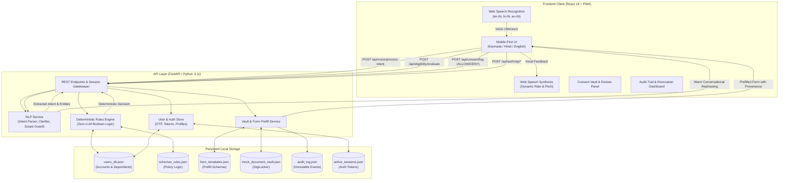
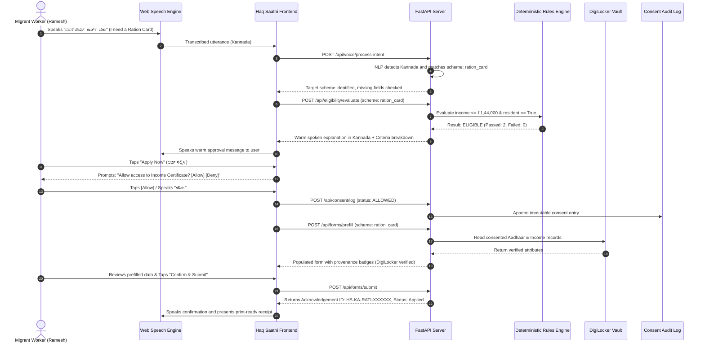
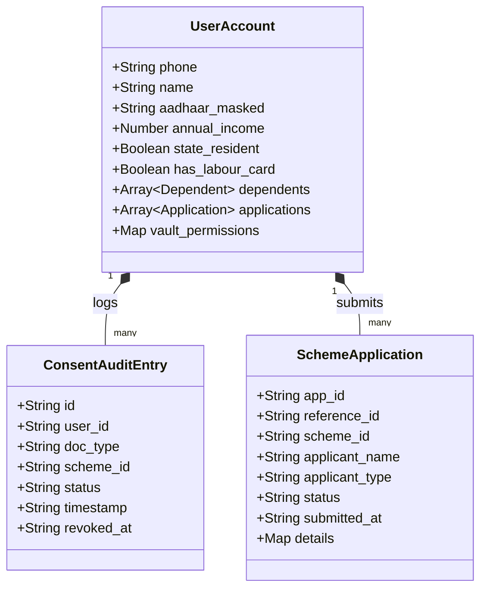

# 🏛️ Haq Saathi (ಹಕ್ಕು ಸಾಥಿ / हक़ साथी) — Comprehensive Project Report
### Voice-First, Consent-Governed Entitlement Navigator for Migrant Workers

---

## 1. Executive Summary

### 1.1 Socio-Economic Problem Context
India hosts an estimated **450+ million internal migrant citizens**, many of whom work as daily-wage earners, construction laborers, domestic help, and agricultural workers. Despite substantial government allocations across state and central welfare schemes, millions of eligible citizens are excluded due to deep systemic barriers:

1. **Linguistic and Literacy Barriers**: Government welfare portals and formal documentation employ complex administrative terminology in English or literary regional scripts, creating prohibitive cognitive friction for low-literacy or dialect-speaking citizens.
2. **Exploitative Middlemen ("Dalals" / Intermediaries)**: Because official systems are opaque and difficult to navigate, vulnerable workers routinely forfeit 20% to 50% of their entitlements or wage earnings to private agents simply to complete basic application forms.
3. **Data Sovereignty and Privacy Exploitation**: Low-income citizens are routinely coerced into surrendering physical originals or unencrypted photocopies of Aadhaar cards, bank passbooks, and caste certificates without knowledge of where their data is stored, who accesses it, or how to revoke access.
4. **Opaque and Inscrutable Eligibility Decisions**: When rejected, applicants rarely receive actionable explanations, making it impossible to determine whether an error was due to an income mismatch, an incomplete profile field, or an invalid age threshold.

### 1.2 The Haq Saathi Solution
**Haq Saathi** (*"Companion for Rights"*) is a voice-first, privacy-governed Progressive Web Application (PWA) built specifically for low-literacy migrant workers. The platform addresses these challenges through five foundational pillars:

- **Trilingual Conversational Voice Pipeline**: Zero-typing, natural speech interaction in **Kannada (`kn-IN`)**, **Hindi (`hi-IN`)**, and **Indian English (`en-IN`)**, with dynamic text-to-speech audio guidance.
- **Strict Zero-LLM Deterministic Rules Engine**: Algorithmic policy decisions are never delegated to probabilistic Large Language Models. Eligibility calculations are evaluated via an auditable, boolean JSON rules engine.
- **Simulated DigiLocker Consent Vault**: Eliminates error-prone document scanning and untrusted physical document handover. Records are retrieved directly from a sovereign vault only with granular, per-document user consent.
- **Real-Time Revocable Audit Trail**: An append-only audit trail logs every consent grant, view, and revocation event with timestamped transparency.
- **Proxy and Dependent Welfare Support**: Enables primary users to manage applications on behalf of elderly parents, spouses, or children with dedicated dependent profile isolation.

---

## 2. System Architecture & Component Interaction

Haq Saathi decouples natural language interaction from deterministic eligibility logic, ensuring that natural language processing aids communication without compromising legal rule fidelity.

### 2.1 High-Level Architecture



---

### 2.2 End-to-End Application Lifecycle Sequence



---

## 3. Technology Stack & Design Decisions

| Layer / Subsystem | Technology Used | Architectural Rationale |
|---|---|---|
| **Client Core** | React 18 (Standalone SPA) | Reactive state management for real-time speech states, multi-step review dialogs, and visual status steppers without complex build pipelines. |
| **Speech Processing** | Web Speech API (`SpeechRecognition`) | Low-latency, client-side speech recognition supporting `kn-IN`, `hi-IN`, and `en-IN` without sending raw audio payloads over the network. |
| **Speech Vocalization** | Web Speech API (`SpeechSynthesis`) | Browser-native audio generation configured at comfortable cadences ($0.95\times$ speed) and clear pitches for low-literacy comprehension. |
| **PWA Infrastructure** | Service Worker + Web App Manifest | Full-screen standalone execution on mobile devices, offline asset caching, and responsive viewport optimization. |
| **Backend Server** | Python 3.11 + FastAPI + Uvicorn | High-throughput asynchronous REST server with Pydantic request/response validation and auto-generated OpenAPI documentation. |
| **Rules Engine** | Pure Deterministic Python (`rules_engine.py`) | Auditable, explainable, and zero-hallucination policy evaluation adhering strictly to published government criteria. |
| **Data Persistence** | Flat-file JSON Stores (`/data`) | Isolated, versionable file-based stores simulating production relational/document databases without external database daemon dependencies. |

---

## 4. In-Depth Component Analysis

### 4.1 Pure Deterministic Rules Engine (`backend/rules_engine.py`)
> [!IMPORTANT]
> **Zero-LLM Decision Policy**: Large Language Models are strictly prohibited from evaluating, computing, or deciding welfare eligibility. All criteria are processed by an auditable deterministic algorithm.

The function `evaluate_scheme_eligibility(scheme, user_data)` validates each policy rule independently:

$$\text{Eligible} = \bigwedge_{i=1}^n \left( \text{Evaluator}(R_i, \text{UserData}) == \text{True} \right)$$

1. **State Residency**:
   $$\text{Result} = (\text{UserData.state\_resident} == \text{Rule.state\_resident})$$
2. **Income Ceiling**:
   $$\text{AnnualIncome} = \text{UserData.annual\_income} \;\lor\; (\text{UserData.monthly\_income} \times 12)$$
   $$\text{Result} = (\text{AnnualIncome} \le \text{Rule.annual\_income\_max})$$
3. **Age Qualification**:
   $$\text{Result} = (\text{UserData.age} \ge \text{Rule.min\_age})$$
4. **Occupation Classification**:
   Evaluates against normalized labor classifications:
   $$\text{Occupation} \in \{\text{construction\_worker}, \text{mason}, \text{labourer}, \text{building\_worker}, \text{coolie}\}$$
5. **Welfare Board Registration**:
   $$\text{Result} = (\text{UserData.has\_labour\_card} == \text{True})$$
6. **Child School Enrollment**:
   $$\text{Result} = (\text{UserData.has\_school\_going\_child} == \text{True})$$

---

### 4.2 NLP Service & Trilingual Voice Gateway (`backend/nlp_service.py`)
The NLP service functions exclusively as an entity extractor and conversational translator:
- **Speech Intent Extraction**: Identifies scheme keywords, income figures (e.g., *"twelve thousand"*, *"ಹನ್ನೆರಡು ಸಾವಿರ"*, *"बारह हज़ार"*), and boolean responses across Kannada, Hindi, and English.
- **Available Schemes Scanner**: Recognizes over 50 variations of open-ended queries (*"What schemes can I get?"*, *"ಯಾವ ಯೋಜನೆಗಳು ಲಭ್ಯವಿವೆ?"*, *"मेरे लिए कौन सी योजनाएं हैं?"*) and triggers automated full-portfolio scans.
- **Colloquial Term Clarifications**: Explains confusing bureaucratic concepts (e.g., *"Annual Family Income"*, *"BOCW Card"*) using everyday analogies.
- **Out-of-Scope Code Guard**: Protects the state machine by identifying non-welfare requests and speaking standardized, compassionate refusal prompts without resetting the applicant's progress.

---

### 4.3 Simulated DigiLocker Vault & Consent Manager (`backend/vault_service.py`)
- **Zero Document Upload Friction**: Citizens are never asked to scan or upload sensitive files. Verified credentials reside in a mock DigiLocker repository.
- **Granular Consent Handshake**: When an application requires verified documentation (e.g., Income Certificate or Aadhaar), a prominent prompt requires explicit user authorization.
- **Provenance Badges**: Prefilled form inputs display clear provenance attribution tags:
  - `DigiLocker (UIDAI Aadhaar Card)`
  - `DigiLocker (Karnataka Revenue Dept - Income Certificate)`
  - `Registered Beneficiary Profile`
- **Instant Revocation**: Users can revoke document authorization at any time, immediately halting data access and marking the audit trail record as `REVOKED`.

---

### 4.4 User Store & Security Isolation (`backend/user_store.py`)
- **Multi-User Partitioning**: Account data in `data/users_db.json` is strictly partitioned by validated mobile number.
- **Session Security**: Authenticated operations require a valid `X-Session-Token`. Unauthorized cross-account access attempts trigger an immediate `HTTP 403 Forbidden`.
- **PII Data Masking**: Sensitive identity identifiers are permanently masked in memory, API payloads, and frontend views:
  - Aadhaar: `XXXX XXXX 8912`
  - PAN: `XXXXX4412K`
- **Proxy Applicant Isolation**: Dependents (e.g., elderly parents or minor children) are stored within a dedicated sub-array under the primary account, preventing accidental overwriting of primary beneficiary attributes.

---

## 5. Welfare Scheme Rulebook & Evaluated Scenarios

The platform currently models four high-impact social welfare schemes:

| Scheme ID | Scheme Name & Authority | Target Beneficiaries | Key Eligibility Criteria | Evaluation for Primary Seed Profile (Ramesh Naik, Age 32, Income ₹1.44L) |
|---|---|---|---|:---:|
| `ration_card` | **Karnataka Ahara BPL Ration Card** *(Food & Civil Supplies)* | Below Poverty Line families | • Karnataka Resident<br>• Annual Family Income $\le$ ₹1,44,000 | ✅ **ELIGIBLE**<br>Income meets exact ceiling; verified Bengaluru resident. |
| `health_cover` | **Ayushman Bharat – Arogya Karnataka (AB-ArK)** | BPL & NFSA households | • Karnataka Resident<br>• BPL Ration Card or Income $\le$ ₹1,80,000 | ✅ **ELIGIBLE**<br>Category A beneficiary: ₹5 Lakh/year cashless coverage. |
| `child_scholarship` | **Karnataka BOCW Pre-Matric Child Scholarship** | Registered construction workers' children | • Active BOCW Board registration<br>• Child enrolled in Classes 1–10 | ✅ **ELIGIBLE**<br>Possesses active BOCW card (`KA-BOCW-2022-847291`); son in Class 4. |
| `pension` | **Sandhya Suraksha Senior Citizen Social Security Pension** | Destitute elderly citizens | • Age $\ge$ 65 years<br>• Annual Income $\le$ ₹20,000 | ❌ **NOT ELIGIBLE**<br>Applicant is 32; fails minimum age threshold of 65. Transparently explained. |

---

## 6. Security, Privacy & Compliance Architecture



1. **Principle of Purpose Limitation**: Consented documents are scoped solely to the specific scheme application for which permission was granted.
2. **Deterministic Idempotency**: Application submissions generate deterministic, unique acknowledgement IDs (`REF-XXXXXXXX` / `HS-KA-...`) that prevent duplicate submissions upon network retries.
3. **Cross-User Defense-in-Depth**: Every data retrieval operation validates both phone number hygiene and session token ownership.
4. **Accessible Error Remediation**: When speech input is unclear, the system repeats the exact captured text and prompts for clarification rather than making unverified guesses.

---

## 7. Automated Test Suite & Quality Assurance

The codebase includes an extensive suite of automated end-to-end and regression tests:

| Test Suite File | Verification Scope | Status |
|---|---|:---:|
| [`test_e2e.py`](file:///c:/Users/shrey/Downloads/final/test_e2e.py) | 10-step full API flow (Index, Profile, Schemes, Voice Intent, Rules, Prefill, Submit, Revoke) | ✅ **10/10 PASS** |
| [`test_section11_e2e.py`](file:///c:/Users/shrey/Downloads/final/test_section11_e2e.py) | Section 11 trilingual voice registration, typing-only numeric inputs, photo preview, and proxy audit | ✅ **10/10 PASS** |
| [`test_five_bug_fixes.py`](file:///c:/Users/shrey/Downloads/final/test_five_bug_fixes.py) | Regression verification for voice capture, unregistered phone guards, and spoken summaries | ✅ **PASS** |
| [`test_voice_reg_and_lang.py`](file:///c:/Users/shrey/Downloads/final/test_voice_reg_and_lang.py) | Voice responsiveness ($<50\text{ms}$ reaction), silence delays, and keyboard fallbacks | ✅ **PASS** |

---

## 8. Deployment & Operational Run Guide

### 8.1 System Requirements
- Python 3.10 or higher
- Modern Chromium-based browser (Google Chrome, Microsoft Edge) supporting the Web Speech API

### 8.2 Execution Instructions
```powershell
# Navigate to the workspace directory
cd c:\Users\shrey\Downloads\final

# Install dependencies (fastapi, uvicorn, requests, pydantic)
python -m pip install -r requirements.txt

# Launch the application server
python run.py
```

- **Application Web UI**: [http://127.0.0.1:8000](http://127.0.0.1:8000)
- **Interactive OpenAPI Documentation**: [http://127.0.0.1:8000/docs](http://127.0.0.1:8000/docs)

---

## 9. Conclusion & Production Roadmap
Haq Saathi demonstrates that voice-first, citizen-centric public digital infrastructure can dramatically simplify welfare access for underserved populations without compromising on data sovereignty, auditability, or decision integrity. By combining browser-native speech interfaces with pure deterministic rules engines, the platform offers an equitable, transparent blueprint for next-generation civic technology in India.
