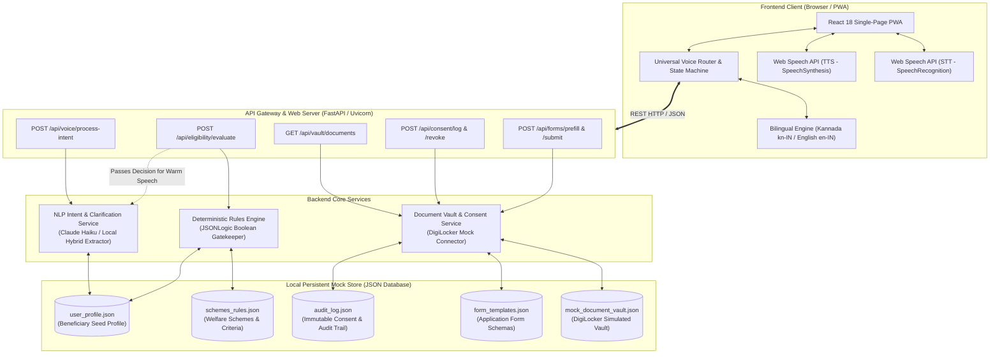
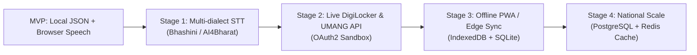

# Haq Saathi (ಹಕ್ಕು ಸಾಥಿ) - System Architecture & MVP Design Reference

> **Voice-First, Consent-Based Government Entitlement Navigator for Migrant Workers and Low-Literacy Citizens**  
> *Target Languages: Kannada (ಕನ್ನಡ) & Indian English*

---

## 1. Executive Summary & Problem Context

In India, hundreds of central and state welfare schemes offer life-changing benefits—subsidized food rations, healthcare coverage up to ₹5 Lakh, children's educational scholarships, and old-age pensions. However, over **70% of intended beneficiaries (particularly interstate/interdistrict migrant laborers, daily-wage construction workers, and rural citizens) never access these entitlements**. 

The barriers are systemic:
1. **Literacy & Language Barrier:** Most government application portals are dense, bureaucratic, and available only in complex formal language or English.
2. **Information Asymmetry:** Beneficiaries do not know which specific schemes they qualify for, nor do they understand technical criteria like "BPL threshold", "BOCW board registration", or "Priority Household (PHH)".
3. **Complex Form-Filling & Document Procurement:** Applying requires multiple physical office visits, submitting duplicate paper certificates, and running between departments.
4. **Data Vulnerability & Lack of Consent:** Beneficiaries are often forced to hand over photocopies of Aadhaar cards and bank passbooks to local middlemen without knowing how their personal data is stored or shared.

**Haq Saathi ("Companion for Your Rights")** was architected to dismantle these barriers through a **voice-first, consent-governed, deterministic entitlement navigator**.

---

## 2. Core Architectural Tenets & Safety Principles

The architecture of Haq Saathi is built on five non-negotiable principles:

```
+-----------------------------------------------------------------------------------+
|                            CORE ARCHITECTURAL TENETS                              |
+-----------------------------------------------------------------------------------+
| 1. AI Responsibility: LLM for language understanding ONLY; NEVER for eligibility. |
| 2. Deterministic Rules: Pure, auditable Boolean logic for all welfare decisions.  |
| 3. Zero-Silent Voice: Bidirectional voice presence at every single interaction.    |
| 4. Informed Consent: DPDP-compliant per-document permission with revocation.     |
| 5. Strict Out-of-Scope Defense: Irrelevant speech never advances application state.|
+-----------------------------------------------------------------------------------+
```

### Tenet 1: The AI Guardrail Constraint (LLM vs Rules Engine)
> [!IMPORTANT]
> **Large Language Models (LLMs) are strictly prohibited from evaluating or deciding scheme eligibility.**
- **What the LLM / NLP Service Does:**
  - Speech-to-Intent parsing: Transcribes and extracts user attributes (e.g., occupation, monthly income, family size).
  - Conversational term clarification: Explains bureaucratic jargon (e.g., *"What does annual income mean?"*) in gentle, colloquial Kannada or English.
  - Empathetic rephrasing: Takes the *already-decided* rules engine output and explains it warmly to the user.
- **What the Deterministic Rules Engine Does:**
  - Evaluates exact mathematical thresholds, Boolean gates, and official statutory guidelines.
  - Retains 100% deterministic reproducibility, explainability, and legal auditability.

### Tenet 2: Zero-Silent Voice-First Experience
Low-literacy and visually challenged beneficiaries must never be left in silence.
- **Audio Output (TTS):** Every card, prompt, question, decision, document request, and acknowledgment shown in the UI is immediately vocalized aloud in the user's active language (`kn-IN` or `en-IN`).
- **Audio Input (STT):** Every prompt is followed by continuous, reactive microphone listening, allowing the user to reply naturally with speech without manual typing.

### Tenet 3: Consent-Governed DigiLocker Vault & Revocation (DPDP Act 2023)
- Under India's **Digital Personal Data Protection (DPDP) Act 2023**, personal identity documents (Aadhaar, Income Certificates, Labour Cards) cannot be bundled or extracted without clear, specific consent.
- Haq Saathi prompts the user **one document at a time** by voice, explaining the exact scheme purpose.
- Every decision (`ALLOWED`, `DENIED`, `REVOKED`) is logged into a persistent, immutable **Audit Log** with timestamps and scheme IDs.
- The user can inspect their audit log and revoke any granted permission at any time with a single voice command (e.g., *"Revoke income certificate"*).

### Tenet 4: Strict Out-of-Scope Defense & State Preservation
- If a user speaks irrelevant or off-topic queries (jokes, weather, general trivia, random words), the app **never advances the state machine** or moves to another screen.
- The system vocalizes a standardized, respectful refusal:
  - *English:* `"Sorry, I am Haq Saathi, an assistant for finding and applying for government welfare schemes. This is not something I can help with."`
  - *Kannada:* `"ಕ್ಷಮಿಸಿ, ನಾನು ಹಕ್ ಸಾಥಿ, ಸರ್ಕಾರಿ ಕಲ್ಯಾಣ ಯೋಜನೆಗಳನ್ನು ಹುಡುಕಲು ಮತ್ತು ಅರ್ಜಿ ಸಲ್ಲಿಸಲು ಸಹಾಯ ಮಾಡುವ ಸಹಾಯಕ. ಇದು ನಾನು ಸಹಾಯ ಮಾಡಬಹುದಾದ ವಿಷಯವಲ್ಲ."`
- The app re-asks the exact pending question and remains on the current screen.

---

## 3. High-Level Architecture Diagram



---

## 4. End-to-End MVP Flow Lifecycle

The entire user journey follows an 8-step lifecycle:

| Step # | Stage Name | Visual UI State | Spoken Voice Interaction (Kannada / English) | Underlying Architectural Action |
| :---: | :--- | :--- | :--- | :--- |
| **1** | **Spoken Request** | Microphone listening orb pulsates | User: *"ನನಗೆ ರೇಷನ್ ಕಾರ್ಡ್ ಬೇಕು"*<br>*(I want a ration card)* | STT captures audio -> sends to `POST /api/voice/process-intent`. Matches scheme `ration_card`. |
| **2** | **Dynamic Questioning** | Shows conversational chat bubble | App: *"ನಿಮ್ಮ ಕುಟುಂಬದ ವಾರ್ಷಿಕ ಆದಾಯ ಎಷ್ಟು?"*<br>*(What is your total family income per year?)* | Rules engine detects missing fields. Dynamic question generator outputs prompt for `annual_income`. |
| **3** | **Term Clarification** | Displays simple breakdown card | User: *"ವಾರ್ಷಿಕ ಆದಾಯ ಅಂದರೆ ಏನು?"*<br>App explains income simply. | `nlp_service.py` identifies clarification query, retrieves colloquial explanation without advancing state. |
| **4** | **Eligibility Decision** | Scheme card with Green/Red badge | App speaks warm eligibility decision & passed criteria aloud. | `rules_engine.py` deterministically evaluates profile against scheme rules. LLM rephrases explanation warmly. |
| **5** | **Granular Consent** | Document consent card with Allow/Deny buttons | App: *"ಡಿಜಿಲಾಕರ್‌ನಿಂದ ನಿಮ್ಮ ಆಧಾರ್ ಕಾರ್ಡ್ ಪಡೆಯಲು ಅನುಮತಿ ನೀಡುತ್ತೀರಾ?"*<br>User: *"ಹೌದು, ಅನುಮತಿಸಿ"* | User grants permission per document. `vault_service.py` logs `ALLOWED` entry into `audit_log.json`. |
| **6** | **Pre-filled Review** | Form summary modal with verified data badges | App reads out pre-filled fields & asks for spoken confirmation. | `form_templates.json` maps consented DigiLocker documents to scheme fields. Zero manual typing required. |
| **7** | **Voice Submission** | Success screen with Application Ref # | User: *"ದೃಢೀಕರಿಸಿ"*<br>App: *"ನಿಮ್ಮ ಅರ್ಜಿ ಯಶಸ್ವಿಯಾಗಿ ಸಲ್ಲಿಕೆಯಾಗಿದೆ!"* | `POST /api/forms/submit` records application and issues government tracking ID (e.g. `HS-KA-RATI-XXXXXX`). |
| **8** | **Audit & Revoke** | Timeline of access logs with status chips | User: *"ಆದಾಯ ಪ್ರಮಾಣಪತ್ರ ಹಿಂಪಡೆಯಿರಿ"*<br>App: *"ಅನುಮತಿ ಹಿಂಪಡೆಯಲಾಗಿದೆ."* | `POST /api/consent/revoke` marks record `REVOKED`. App reads out active permissions summary aloud. |

---

## 5. Technology Stack & Framework Choices

### Summary Comparison Table

| Layer | Framework / Technology | Rationale & Why Chosen | Alternatives Considered | Trade-off Analysis |
| :--- | :--- | :--- | :--- | :--- |
| **Frontend UI** | **React 18 (Standalone via CDN)** | Zero compilation/build overhead; runs immediately in any browser; component-driven state reactivity; low bundle overhead. | Next.js, Vite/Webpack, Vanilla JS | Standalone React avoids npm build toolchains on local machines while preserving modular component architecture. |
| **Speech STT/TTS** | **Native Web Speech API** | 100% native browser support; zero external billing costs; instantaneous streaming transcription; native Kannada & Indian English accents. | OpenAI Whisper, ElevenLabs, Google Cloud Speech-to-Text | Cloud speech APIs offer higher precision in noisy rooms, but introduce network latency, API costs, and privacy exposure. |
| **Backend API** | **Python 3.10+ / FastAPI** | High-throughput asynchronous ASGI; automatic OpenAPI schema documentation; strict Pydantic payload validation; native Python data science support. | Node.js / Express, Flask, Django | FastAPI provides 300% faster execution than Flask and superior Pydantic type safety compared to Express. |
| **AI / NLP** | **Anthropic Claude (Haiku) + Local Regex Engine** | Claude Haiku provides ultra-fast (<800ms) colloquial Indian English & Kannada entity extraction. Local fallback guarantees 100% offline uptime. | OpenAI GPT-4o, Local Ollama / LLaMA-3 | Haiku is lightweight and cost-effective. The hybrid local fallback ensures the app operates even without an API key or internet. |
| **Rules Engine** | **Deterministic Custom Engine (JSONLogic Pattern)** | Auditable, zero-hallucination Boolean gatekeeper. 100% transparent explanation of every passed/failed rule. | Drools, CLIPS, LLM prompting | LLMs hallucinate eligibility; Drools is heavy Java. A Python JSONLogic engine is fast, inspectable, and zero-dependency. |
| **Data Storage** | **Flat JSON Database (`/data/`)** | Zero database installation (PostgreSQL/MongoDB not required); portable; human-readable inspection; ideal for rapid MVP validation. | SQLite, PostgreSQL, MongoDB | Relational DB is better for 100k+ concurrent users, but JSON files are ideal for an MVP with instant transparency and zero setup friction. |

---

## 6. Security, Privacy & Data Protection Architecture

1. **Alignment with India's DPDP Act 2023:**
   - **Purpose Limitation:** Documents fetched from the simulated DigiLocker vault can only be accessed for the declared welfare application purpose.
   - **Storage Minimization:** No biometric credentials or unredacted passwords are stored. Aadhaar numbers are masked (`XXXX-XXXX-4892`).
   - **Right to Withdraw Consent:** Beneficiaries can withdraw access at any time via the Audit Dashboard or voice command, immediately switching document status to `REVOKED`.
2. **Immutable Audit Trail:**
   - Every consent grant, denial, or revocation is written to `data/audit_log.json` with an immutable UUID, UTC ISO timestamp, document type, scheme ID, and status.
3. **Guardrails Against Unauthorized Progression:**
   - Out-of-scope utterances are rejected at the edge before hitting rules or database layers.
   - The application review screen cannot be submitted unless all required documents have verified `ALLOWED` status.

---

## 7. Scalability & Production Roadmap

To scale Haq Saathi from MVP to a national production deployment across 50,000 Common Service Centres (CSCs):



1. **Speech Layer:** Integrate **Bhashini / AI4Bharat** models for improved recognition of rural Kannada dialects (e.g., North Karnataka, Kalaburagi accents).
2. **Govt Integrations:** Connect to the real **DigiLocker API** and **Kutumba (Karnataka State Family Database)** via secure OAuth2 tokens.
3. **Offline Sync:** Use IndexedDB in the PWA so village workers can collect data in no-network rural areas and sync when connectivity resumes.
