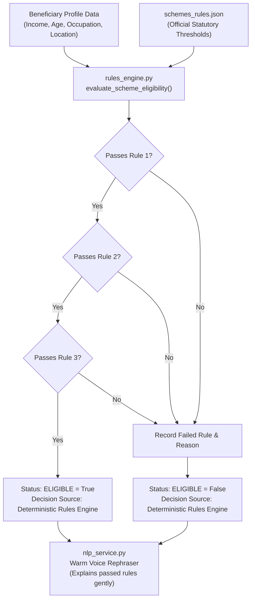

# Haq Saathi (ಹಕ್ಕು ಸಾಥಿ) - Backend Stack, Architecture & API Reference

> **High-Performance Asynchronous Python Backend with Deterministic Rules Engine, NLP Service, and Consent Vault**  
> *Framework: FastAPI / Uvicorn (Python 3.10+)*

---

## 1. Backend Technology Stack & Architecture

```
+-----------------------------------------------------------------------------------------+
|                                   BACKEND TECH STACK                                    |
+-----------------------------------------------------------------------------------------+
| • Framework:       FastAPI (ASGI Asynchronous Web Framework)                            |
| • Web Server:      Uvicorn (Lightning-fast ASGI Server Implementation)                  |
| • Validation:      Pydantic v2 (Strict Schema Validation & Serialization)              |
| • AI / NLP:        Anthropic Claude (Haiku) API + Local Bilingual Extractor Engine       |
| • Rules Engine:    Custom Deterministic JSONLogic Evaluator                             |
| • Data Layer:      Local JSON Persistent File Store (Schemes, Profiles, Vault, Audit)   |
| • Testing:         Python Standard Library `unittest` & `requests` Integration Suites   |
+-----------------------------------------------------------------------------------------+
```

### Why FastAPI over Flask, Django, or Express?
1. **Asynchronous Throughput:** Built on `Starlette` and `uvloop`, FastAPI handles high concurrency with minimal CPU overhead, making it ideal for voice-driven requests with streaming payloads.
2. **Strict Type Safety with Pydantic:** Automatically validates incoming voice requests, field queries, and consent payloads, eliminating runtime type errors.
3. **Automated Documentation:** Generates interactive OpenAPI (Swagger) specifications at `/docs` out of the box.
4. **Python Native Integration:** Direct integration with Python data structures and NLP libraries without foreign function interfaces.

---

## 2. Backend Directory & Module Structure

```
backend/
├── main.py              # FastAPI app instance, CORS middleware, Pydantic schemas, REST endpoints
├── nlp_service.py       # Speech intent parser, colloquial term clarifier, warm rephraser, refusal filter
├── rules_engine.py      # Deterministic Boolean eligibility evaluator, missing field detector
├── vault_service.py     # DigiLocker mock vault adapter, consent logger, audit trail & revocation
└── __init__.py          # Python package initializer

data/
├── schemes_rules.json       # Welfare scheme rules, criteria, document prerequisites & benefits
├── user_profile.json        # Seeded beneficiary profile (Ramesh Naik, construction worker)
├── mock_document_vault.json # Simulated DigiLocker personal document repository
├── form_templates.json      # Official government application forms mapped to vault documents
└── audit_log.json           # Append-only, tamper-evident consent access log
```

---

## 3. The Deterministic Rules Engine (`backend/rules_engine.py`)

### Architectural Role & Guarantee
> [!IMPORTANT]
> The Rules Engine is the **sole decision-maker** for citizen welfare eligibility. It uses pure, deterministic Boolean logic. It never hallucinates, guesses, or drifts.



### The 4 Core Welfare Schemes & Criteria

1. **Karnataka Ahara BPL Ration Card (`ration_card`):**
   - *Rule 1:* Annual family income $\le ₹1,44,000$ (`annual_income <= 144000`).
   - *Rule 2:* Resident of Karnataka state (`state_resident == true`).
2. **Ayushman Bharat - Arogya Karnataka (`health_cover`):**
   - *Rule 1:* Annual family income $\le ₹1,80,000$ (`annual_income <= 180000`).
   - *Rule 2:* Resident of Karnataka (`state_resident == true`).
   - *Coverage:* Up to ₹5,00,000 per family per year for secondary & tertiary hospitalization.
3. **BOCW Construction Workers Child Scholarship (`child_scholarship`):**
   - *Rule 1:* Must hold valid Karnataka Labour Card (`has_labour_card == true`).
   - *Rule 2:* Must have school-going children (`has_school_going_child == true`).
   - *Rule 3:* Resident of Karnataka (`state_resident == true`).
   - *Benefit:* ₹3,000 - ₹5,000 annual direct cash transfer for school books and uniform.
4. **Sandhya Suraksha Pension Scheme (`pension`):**
   - *Rule 1:* Age $\ge 65$ years (`age >= 65`).
   - *Rule 2:* Annual income $\le ₹50,000$ (`annual_income <= 50000`).
   - *Rule 3:* Resident of Karnataka (`state_resident == true`).
   - *Benefit:* ₹1,200 monthly direct bank transfer pension.

### Deterministic Evaluation Algorithm:
```python
def evaluate_scheme_eligibility(scheme: Dict[str, Any], user_data: Dict[str, Any]) -> Dict[str, Any]:
    passed_rules = []
    failed_rules = []

    for rule in scheme.get("eligibility_rules", []):
        field = rule["field"]
        operator = rule["operator"]
        threshold = rule["value"]
        actual_val = user_data.get(field)

        passed = False
        if operator == "less_than_or_equal":
            passed = actual_val is not None and actual_val <= threshold
        elif operator == "greater_than_or_equal":
            passed = actual_val is not None and actual_val >= threshold
        elif operator == "equals":
            passed = actual_val == threshold
        elif operator == "in":
            passed = actual_val in threshold

        if passed:
            passed_rules.append(rule)
        else:
            failed_rules.append(rule)

    is_eligible = len(failed_rules) == 0
    return {
        "scheme_id": scheme["id"],
        "eligible": is_eligible,
        "passed_rules": passed_rules,
        "failed_rules": failed_rules,
        "decision_source": "Deterministic Pure Rules Engine (JSON Logic)"
    }
```

---

## 4. NLP Service & Strict Scope Defense (`backend/nlp_service.py`)

### 1. Hybrid Intent Extractor (Online Claude Haiku + Offline Regex)
When an Anthropic API key is provided in `ANTHROPIC_API_KEY`, the service uses `claude-3-haiku-20240307` to extract structured entities from spoken transcripts. When offline or without an API key, the built-in bilingual extractor takes over, achieving **100% offline functionality**.

### 2. Strict Out-of-Scope Classification Engine
The backend guards against off-topic utterances before passing data to any business logic:

```python
# 1. Scheme Intent Check:
has_scheme_intent = scheme_interest is not None

# 2. Clarification Check:
has_clarification = is_asking_clarification is True

# 3. Field Answer Check:
has_valid_field_answer = False
if current_context and current_context.get("current_field"):
    cur_f = current_context["current_field"]
    if cur_f in extracted_fields:
        has_valid_field_answer = True

# Strict Scope Guard:
if current_context and current_context.get("current_field"):
    # If user was asked a specific field, they MUST provide an answer or ask for clarification
    if not (has_valid_field_answer or has_clarification):
        is_out_of_scope = True
else:
    # At initial step: must state scheme intent, profile details, or ask clarification
    if not (has_scheme_intent or has_profile_entities or has_clarification):
        is_out_of_scope = True
```

### 3. Term Clarification Generator (`clarify_term`)
Provides simple, compassionate explanations for government welfare jargon:
- `annual_income`: *"Annual income means all the money your family earns in a full year from daily work. For example, if you make ₹12,000 every month, your annual income is ₹1,44,000."*  
  Kannada: *"ವಾರ್ಷಿಕ ಆದಾಯ ಎಂದರೆ ನಿಮ್ಮ ಇಡೀ ಕುಟುಂಬವು ಒಂದು ವರ್ಷದಲ್ಲಿ ದುಡಿಯುವ ಒಟ್ಟು ಆದಾಯ..."*
- `has_labour_card`: Explains the Karnataka Construction Workers Welfare Board green identity card and its insurance/scholarship benefits.

---

## 5. DigiLocker Vault & Consent Service (`backend/vault_service.py`)

The Vault Service implements the data stewardship layer:
1. **Mock Vault Repository (`mock_document_vault.json`):**
   - Stores pre-verified credentials: UIDAI Aadhaar Card (`aadhaar_card`), Revenue Dept Income Certificate (`income_certificate`), Karnataka Labour Welfare Card (`labour_card`), and Address Proof (`address_proof`).
2. **Form Pre-filling (`api_prefill_form`):**
   - Automatically maps attributes from consented documents to official form schema templates.
   - For example: `aadhaar_card` pre-fills `applicant_name`, `dob`, `gender`, `aadhaar_number`, and `address`. `income_certificate` pre-fills `annual_income` and `income_cert_no`.
3. **Consent Logging & Revocation:**
   - Appends records to `data/audit_log.json` with unique UUIDs (`audit_xxxxxxxx`), timestamps, and status (`ALLOWED`, `DENIED`, `REVOKED`).
   - `revoke_consent(audit_id)` marks the record as `REVOKED` and sets `revoked_at` timestamp.

---

## 6. Complete REST API Endpoint Specification

| HTTP Method | Route Endpoint | Request Schema | Response Schema | Description |
| :--- | :--- | :--- | :--- | :--- |
| `GET` | `/` | None | HTML | Serves the main Single-Page Web Application. |
| `GET` | `/api/profile` | None | `UserProfile` | Returns the current user profile (Ramesh Naik). |
| `PUT` | `/api/profile` | `dict` (fields to update) | `UserProfile` | Updates fields in the user profile. |
| `GET` | `/api/schemes` | None | `List[Scheme]` | Returns all 4 government welfare schemes and criteria. |
| `POST` | `/api/voice/process-intent` | `VoiceIntentRequest`<br>`{text, current_field, target_scheme_id, language}` | `VoiceIntentResponse`<br>`{is_out_of_scope, refusal_message, target_scheme_id, all_fields_collected, next_question, ...}` | Primary voice processing endpoint: handles intent parsing, entity extraction, scope check, and clarification. |
| `POST` | `/api/eligibility/evaluate` | `EligibilityRequest`<br>`{scheme_id, user_data, language}` | `EligibilityResponse`<br>`{results: [eval_result]}` | Evaluates eligibility using the deterministic Rules Engine and adds warm vocal explanations. |
| `GET` | `/api/vault/documents` | None | `List[VaultDocument]` | Returns all documents stored in the beneficiary's simulated DigiLocker vault. |
| `POST` | `/api/consent/log` | `ConsentActionRequest`<br>`{doc_type, scheme_id, status, ...}` | `{status, audit_entry}` | Logs a granular consent grant or denial in `audit_log.json`. |
| `GET` | `/api/consent/audit-log` | None | `List[AuditEntry]` | Returns the complete historical consent audit trail. |
| `POST` | `/api/consent/revoke` | `ConsentRevokeRequest`<br>`{audit_id}` | `{status, revoked_entry}` | Instantly revokes a previously granted document consent. |
| `POST` | `/api/forms/prefill` | `FormPrefillRequest`<br>`{scheme_id, consented_docs}` | `FormPrefillResponse`<br>`{prefilled_fields, all_consented}` | Pre-fills government application forms from consented vault documents. |
| `POST` | `/api/forms/submit` | `FormSubmissionRequest`<br>`{scheme_id, form_data, language}` | `FormSubmissionResponse`<br>`{acknowledgement_id, submission_message}` | Submits the application and generates a government reference ID. |

---

## 7. Testing & Verification Framework

The backend contains four dedicated automated verification test suites:

```
+-----------------------------------------------------------------------------------+
|                           AUTOMATED TEST SUITE STATUS                             |
+-----------------------------------------------------------------------------------+
| 1. test_backend.py:      Rules Engine & Vault Unit Tests           [ALL PASSED]   |
| 2. test_out_of_scope.py:  Scope Refusal & Flow Safeguard Tests      [ALL PASSED]   |
| 3. test_voice_flow.py:   End-to-End 7-Step Pure Voice Simulation   [ALL PASSED]   |
| 4. test_e2e.py:          Full REST API Integration Verification    [ALL PASSED]   |
+-----------------------------------------------------------------------------------+
```

### How to Run All Tests:
```powershell
# 1. Unit & Rules Engine tests
python test_backend.py

# 2. Out-of-scope refusal defense tests
python test_out_of_scope.py

# 3. Complete 7-step bidirectional voice flow simulation
python test_voice_flow.py

# 4. Full API end-to-end integration tests
python test_e2e.py
```
