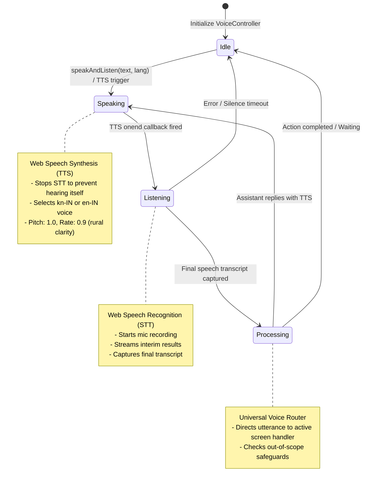

# Haq Saathi (ಹಕ್ಕು ಸಾಥಿ) - Frontend Stack, Architecture & Technical Guide

> **Voice-First, Mobile-First PWA Interface for Low-Literacy Welfare Entitlement Navigation**  
> *Target Languages: Kannada (`kn-IN`) & Indian English (`en-IN`)*

---

## 1. Frontend Technology Stack & Rationale

```
+-----------------------------------------------------------------------------------------+
|                                  FRONTEND TECH STACK                                    |
+-----------------------------------------------------------------------------------------+
| • Framework:       React 18 (Standalone Production Build via CDN)                      |
| • Transpiler:      Babel Standalone (Browser-side JSX compilation)                      |
| • Speech Layer:    W3C Web Speech API (SpeechRecognition & SpeechSynthesis)            |
| • International:   Custom Bilingual i18n Engine (Kannada kn-IN & English en-IN)        |
| • Networking:      Native Fetch API Client with Modular API Adapters                    |
| • Styling & UI:    Custom Responsive CSS3 (Mobile-first, High-contrast, Touch-target)  |
| • PWA Support:     Web App Manifest (manifest.json) & Service Worker (sw.js)            |
+-----------------------------------------------------------------------------------------+
```

### Why React 18 Standalone (No-Build Architecture)?
1. **Zero Build Step & Instant Portability:**
   - Beneficiaries and government field workers (Anganwadi, ASHA, or CSC operators) often operate on low-spec laptops, basic tablets, or mobile devices where running heavy Node.js/Webpack build servers is unfeasible.
   - Using React 18 via production CDN scripts with in-browser Babel allows the app to run directly by serving static files from any lightweight server (FastAPI, Python `http.server`, or Nginx) without an `npm run build` step.
2. **Reactivity & Declarative UI:**
   - React's component model enables dynamic, real-time updates for voice states (pulsating mic indicator, interim speech-to-text transcriptions, and dynamically updating chat messages).
3. **PWA-Ready:**
   - Integrated with `manifest.json` and `sw.js` to enable "Add to Home Screen" on Android smartphones, providing an app-like feel for rural beneficiaries.

---

## 2. Frontend Directory & File Architecture

```
frontend/
├── index.html            # Main entrypoint, CDN tags, audio permission bootstrap, root container
├── manifest.json         # PWA metadata, icons, standalone display mode configuration
├── sw.js                 # Service worker for offline asset caching and PWA shell lifecycle
├── css/
│   └── style.css         # 19KB custom stylesheet: tokens, mobile-first layouts, voice visualizers
└── js/
    ├── voice.js          # Core Voice Controller: Web Speech API STT/TTS wrapper & chaining
    ├── i18n.js           # Bilingual dictionary: Kannada (kn) & English (en) text & vocal strings
    ├── api.js            # Modular REST client for backend communication
    └── app.js            # Main React 18 Application: State Machine, Tab Router, UI Components
```

---

## 3. The Voice Subsystem (`frontend/js/voice.js`)

The `VoiceController` class is a singleton that manages bidirectional speech interactions. It coordinates the browser's speech recognition and speech synthesis engines to eliminate race conditions, audio ducking, and recognition interruptions.



### Key Technical Patterns in `voice.js`:

1. **Self-Hearing Prevention (Echo Cancellation):**
   ```javascript
   // In VoiceController.speak()
   if (this.isListening) {
     this.stopListening(); // Mute microphone while app is speaking
   }
   ```
   If the microphone remained open while the device speaker was reading out text, the speech recognition engine would transcribe its own voice, creating an infinite recursive loop. `voice.js` strictly stops STT before initiating TTS.

2. **Bidirectional Chaining (`speakAndListen`):**
   ```javascript
   speakAndListen(text, lang, onRecognized, options = {}) {
     this.speak(text, lang, () => {
       // Callback triggered when TTS finishes speaking
       if (options.listenAfter !== false) {
         this.startListening((result) => {
           if (result.final) {
             this.stopListening();
             onRecognized(result.final);
           }
         });
       }
     });
   }
   ```
   This pattern powers the "Zero-Silent" experience: the app speaks a prompt aloud, and the exact moment the speaker finishes, the microphone activates to listen for the user's spoken answer.

3. **Dialect & Voice Selection:**
   - Prioritizes Indian English (`en-IN`) voices (e.g., Google Indian English, Microsoft Ravi/Heera) for English mode.
   - Uses `kn-IN` voice tags for Kannada synthesis, tuning the speaking rate to `0.9` (slightly slower than standard 1.0) so that low-literacy users can easily comprehend complex eligibility explanations.

---

## 4. Internationalization Engine (`frontend/js/i18n.js`)

`i18n.js` maintains full parallel dictionaries in **Kannada (`kn`)** and **English (`en`)**. It contains over 100 UI tokens, including:

- **App Branding & Subtitles:** `app_title` ("ಹಕ್ ಸಾಥಿ"), `app_tagline` ("ಸರ್ಕಾರಿ ಯೋಜನೆಗಳ ಧ್ವನಿ ಸಹಾಯಕ").
- **Voice Status Prompts:** `voice_listening` ("ಕೇಳಿಸಿಕೊಳ್ಳುತ್ತಿದ್ದೇವೆ... ಮಾತನಾಡಿ"), `voice_tap_to_speak` ("ಮಾತನಾಡಲು ಮೈಕ್ ಒತ್ತಿ").
- **Standardized Refusal Messages:**
  - `refusal_out_of_scope_en`: `"Sorry, I am Haq Saathi, an assistant for finding and applying for government welfare schemes. This is not something I can help with."`
  - `refusal_out_of_scope_kn`: `"ಕ್ಷಮಿಸಿ, ನಾನು ಹಕ್ ಸಾಥಿ, ಸರ್ಕಾರಿ ಕಲ್ಯಾಣ ಯೋಜನೆಗಳನ್ನು ಹುಡುಕಲು ಮತ್ತು ಅರ್ಜಿ ಸಲ್ಲಿಸಲು ಸಹಾಯ ಮಾಡುವ ಸಹಾಯಕ. ಇದು ನಾನು ಸಹಾಯ ಮಾಡಬಹುದಾದ ವಿಷಯವಲ್ಲ."`
- **Document Vault Metadata:** Kannada translations for Aadhaar (`ಆಧಾರ್ ಕಾರ್ಡ್`), Income Certificate (`ಆದಾಯ ಪ್ರಮಾಣಪತ್ರ`), Labour Card (`ಕಾರ್ಮಿಕ ಕಾರ್ಡ್`), Bank Passbook (`ಬ್ಯಾಂಕ್ ಪಾಸ್‌ಬುಕ್`).

---

## 5. Main Application & State Machine (`frontend/js/app.js`)

`app.js` is the core React application that manages global state, screen routing, conversational flow, and safety guards.

### Global State Structure:
```javascript
const [lang, setLang] = useState('kn');                      // 'kn' (Kannada) or 'en' (English)
const [activeTab, setActiveTab] = useState('home');          // 'home' | 'schemes' | 'consent' | 'review' | 'audit'
const [isListening, setIsListening] = useState(false);        // STT active state
const [isSpeaking, setIsSpeaking] = useState(false);          // TTS active state
const [messages, setMessages] = useState([]);                // Conversation chat stream
const [currentQuestion, setCurrentQuestion] = useState(null);// Currently pending field question
const [targetSchemeId, setTargetSchemeId] = useState(null);  // Focused welfare scheme ID
const [eligibilityResults, setEligibilityResults] = useState([]);// Rules engine output
const [activeDocIndex, setActiveDocIndex] = useState(0);     // Current document in consent flow
const [profile, setProfile] = useState({});                  // User profile cache
const [auditLogs, setAuditLogs] = useState([]);              // Consent audit trail
```

### The Universal Voice Router (`processUniversalVoiceInput`):
Recognized user speech is routed contextually based on the active screen:

```javascript
const processUniversalVoiceInput = (utterance, currentL = lang) => {
  const lower = utterance.toLowerCase().trim();

  // 1. Consent Screen Context
  if (activeTab === 'consent') {
    handleVoiceConsentUtterance(lower, utterance);
    return;
  }
  // 2. Review Screen Context
  if (activeTab === 'review') {
    if (confirmWords.some(w => lower.includes(w))) {
      handleSubmitApplication();
    } else {
      speakAndListen(refusalReview, currentL, ...); // Off-topic refusal
    }
    return;
  }
  // 3. Eligibility Screen Context
  if (activeTab === 'schemes') {
    if (applyWords.some(w => lower.includes(w))) {
      handleStartApply(targetSchemeId);
    } else {
      speakAndListen(refusalSchemes, currentL, ...); // Off-topic refusal
    }
    return;
  }
  // 4. Default: Conversational Questioning Flow (Steps 1, 2, 3)
  processUserUtterance(utterance, currentL);
};
```

---

## 6. Strict Out-of-Scope Defense in the Frontend

To prevent accidental screen advancement on irrelevant input (e.g., *"tell me a joke"*, *"what's the weather today"*):

1. **Edge Check:** When `processUserUtterance` receives the backend response:
   ```javascript
   if (res.is_out_of_scope) {
     // Show refusal message in conversation UI
     setMessages(prev => [...prev, refusalMsg]);

     // Re-ask the exact same pending question without incrementing state
     if (currentQuestion) {
       const rePrompt = currentL === 'kn'
         ? `${res.refusal_message_kn} ಈಗ, ದಯವಿಟ್ಟು ತಿಳಿಸಿ: ${currentQuestion.text_kn}`
         : `${res.refusal_message_en} Now, please tell me: ${currentQuestion.text_en}`;
       speakAndListen(rePrompt, currentL, retry => processUniversalVoiceInput(retry, currentL));
     }
     return; // STOP! Never advance screen on irrelevant input
   }
   ```
2. **Transition Safeguard:**
   ```javascript
   // Only proceed to eligibility screen if a valid scheme was requested AND all fields are collected
   if (!res.is_out_of_scope && res.target_scheme_id && res.all_fields_collected) {
     await runEligibilityEvaluation(res.target_scheme_id, currentL);
   }
   ```

---

## 7. User Interface Components & Screen Breakdown

### Screen 1: Home & Conversational Voice Navigator
- **Audio Wave Visualizer:** Real-time pulsating orb showing whether the system is speaking (amber/blue wave) or listening (green pulsating ring).
- **Dual Language Switcher:** Fixed in header with high-contrast pill toggles: `ಕನ್ನಡ` vs `English`. Toggling immediately re-vocalizes the current prompt in the new language.
- **Chat Feed:** Alternating bubbles with user speech and assistant responses, with a speaker icon to manually replay any message.

### Screen 2: Schemes & Eligibility Results
- **Card-Based Recommendations:** Displays eligibility status badges:
  - `ಅರ್ಹರಾಗಿದ್ದೀರಿ` (Eligible) in Vibrant Green (`#16a34a`).
  - `ಅರ್ಹರಾಗಿಲ್ಲ` (Not Eligible) in Crimson Red (`#dc2626`).
- **Explanation Box:** Displays the warm, empathetic explanation generated from the rules engine passed/failed criteria.
- **Action Buttons:** Large touch targets: *"Apply Now (ಅರ್ಜಿ ಸಲ್ಲಿಸಿ)"* or *"Check Other Schemes"*.

### Screen 3: Granular Document Consent (DigiLocker Vault)
- **Document Cards:** Presents documents one-by-one (Aadhaar, Income Certificate, Labour Card).
- **Purpose Badge:** Transparently shows why the department needs this document (e.g., *"To verify that family income is under ₹1.44 Lakh"*).
- **Dual Voice/Touch Controls:** Large green `Allow (ಅನುಮತಿಸಿ)` and red `Don't Allow (ಬೇಡ)` buttons, both operable by speaking or tapping.

### Screen 4: Application Review & Voice Submission
- **Pre-filled Data Inspection:** Lists all fields pre-populated from consented vault documents with verified checkmarks.
- **Editable Inputs:** Users or operators can correct any pre-filled value.
- **Voice Submission:** Beneficiary simply says *"Submit"* or *"ದೃಢೀಕರಿಸಿ"* to finalize.

### Screen 5: Consent Audit Dashboard & Revocation
- **Live Status Metrics:** Three visual counters for `Allowed (ಸಕ್ರಿಯ)`, `Denied (ನಿರಾಕರಿಸಲಾಗಿದೆ)`, and `Revoked (ಹಿಂಪಡೆಯಲಾಗಿದೆ)` permissions.
- **Interactive Timeline:** Each past consent grant features a red `Revoke Access (ಹಿಂಪಡೆಯಿರಿ)` button that immediately revokes access and reflects in the audit logs.

---

## 8. Accessibility & Low-Literacy Design Standards

1. **Touch Targets >= 48px:** All buttons, mic toggles, and language selectors exceed Android/W3C minimum touch target sizes.
2. **Color Contrast:** Conforms to WCAG 2.1 AA standards (minimum 4.5:1 text-to-background contrast ratio).
3. **No Hidden Gestures:** All actions are accessible through direct, visible one-tap buttons or spoken words.
4. **Visual Redundancy:** Color is never used alone to convey status; all badges include text and clear icons.
