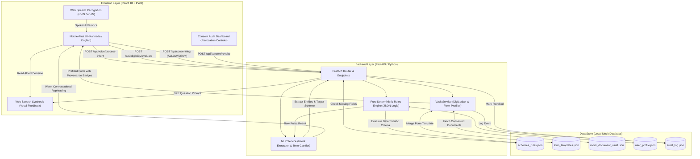
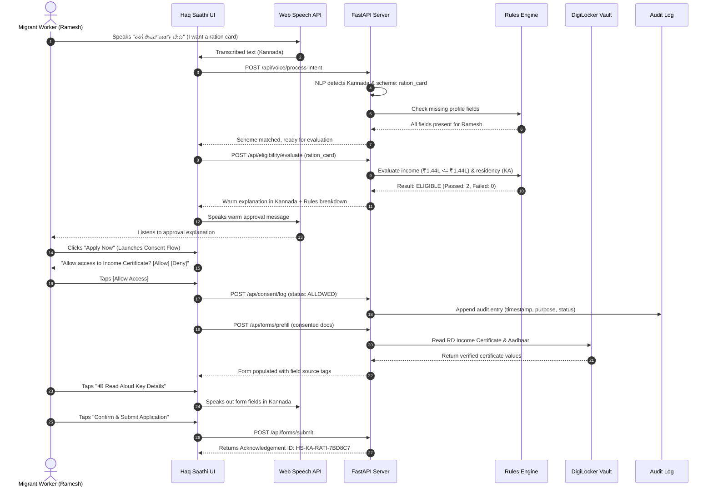

# 🏛️ Haq Saathi (ಹಕ್ಕು ಸಾಥಿ): Comprehensive Technical Project Report
### Voice-First, Consent-Based Welfare Entitlement Navigator for Migrant Workers

---

## 1. Executive Summary

### 1.1 Context and Problem Statement
India has over **450 million internal migrants**, millions of whom work as daily-wage labourers in urban centres such as Bengaluru. Migrant workers frequently miss out on critical social welfare benefits—including subsidized food grains, tertiary healthcare coverage, children's educational scholarships, and social security pensions—due to four structural obstacles:

1. **Linguistic and Literacy Barriers**: Application forms and government portals use formal, Sanskritized administrative Kannada or English. This creates steep cognitive friction for low-literacy or dialect-speaking workers (e.g., North Karnataka dialects spoken in Kalaburagi, Raichur, and Yadgir).
2. **Exploitative Intermediaries ("Brokers/Middlemen")**: Due to procedural opacity, workers often pay substantial portions of their daily wages or benefits to predatory intermediaries for filling out paper applications.
3. **Lack of Granular Data Consent**: Workers are routinely required to surrender physical originals of their Aadhaar cards, bank passbooks, and caste certificates without transparency regarding who inspects their data, where copies are archived, or whether access can be revoked.
4. **Opaque Eligibility Decisions**: Administrative rejections rarely include clear explanations, leaving workers unaware of whether a denial stemmed from an income ceiling, missing paperwork, or age limits.

### 1.2 The Haq Saathi Solution
**Haq Saathi** (*"Companion for Rights"*) is an accessible, voice-first progressive web application built to navigate welfare entitlements with dignity and transparency:

- **Voice-First at Every Single Step**: Beneficiaries speak and listen naturally in Kannada (`kn-IN`) or English (`en-IN`) using browser-native Web Speech recognition (`SpeechRecognition`) and synthesis (`SpeechSynthesis`). Every screen speaks its messages aloud automatically and activates the microphone so users can answer, confirm, or grant consent purely by voice.
- **Centralized `speakAndListen` Engine**: Prevents audio echo and overlaps by awaiting full TTS synthesis before activating speech recognition.
- **Deterministic Zero-LLM Eligibility Decisions**: Eligibility is evaluated strictly by a deterministic JSON Rules Engine—**never by an LLM**—eliminating algorithmic hallucinations, unpredictability, and demographic bias.
- **Step-by-Step Colloquial Guidance**: Missing requirements are requested one at a time via voice, with simple explanations for complex terms like *"Annual Family Income"* (*"ವಾರ್ಷಿಕ ಆದಾಯ"*) or *"BOCW Labour Card"* (*"ಕಾರ್ಮಿಕ ಕಾರ್ಡ್"*).
- **DigiLocker Consent Vault**: Eliminates camera uploads or document scans. Documents are retrieved from a simulated DigiLocker sandbox only upon explicit, granular consent.
- **Revocable Audit Trail**: An append-only audit log records every document access event and empowers the user to revoke consent at any moment.

---

## 2. System Architecture & Flow

The architecture decouples conversational interaction from official policy rules, ensuring that AI enhances usability without compromising decision integrity.

### 2.1 Architecture Diagram



### 2.2 End-to-End Sequence of Operations



---

## 3. Technology Stack & Frameworks

| Component | Technology | Rationale & Trade-offs |
|---|---|---|
| **Frontend Framework** | **React 18** (SPA) | Declarative state management for real-time speech states, multi-step consent modals, and reactive audio visualizer. Loaded via browser runtime to ensure lightweight, zero-build deployment. |
| **Speech-to-Text (STT)** | **Web Speech API** (`SpeechRecognition`) | Zero-latency, browser-native recognition supporting `kn-IN` (Kannada) and `en-IN` (Indian English) without sending audio blobs to expensive external transcription APIs. |
| **Text-to-Speech (TTS)** | **Web Speech API** (`SpeechSynthesis`) | Native vocalization with configurable rate (`0.95x`) and pitch for low-literacy clarity. Selects localized Kannada or English voice engines dynamically. |
| **PWA Infrastructure** | **Service Worker + Web Manifest** | Enables offline asset caching, app shell persistence, standalone full-screen mobile installation, and home screen launch for smartphones. |
| **Styling & UI** | **Custom CSS3 + CSS Variables** | Accessible color palette (Emerald `#059669`, Warm Amber `#d97706`), large touch targets (minimum 48px), responsive grid layouts, and animated audio pulse waves. |
| **Backend Framework** | **Python FastAPI + Uvicorn** | High-performance asynchronous REST API framework with native Pydantic schema validation, self-documenting OpenAPI endpoints, and lightweight execution footprint. |
| **Rules Engine** | **Pure Python Logic (`rules_engine.py`)** | Deterministic, transparent, auditable if/else condition engine based purely on JSON rule definitions. |
| **Mock Database** | **Structured JSON Files (`/data`)** | File-backed mock persistence (`schemes_rules.json`, `form_templates.json`, `mock_document_vault.json`, `audit_log.json`) allowing inspectability and zero-dependency reproducibility. |

---

## 4. Core Logic & Implementation Deep-Dive

### 4.1 Strict Zero-LLM Eligibility Policy (`backend/rules_engine.py`)
To prevent hallucinated criteria and protect citizens from unlawful denials, eligibility decisions are strictly isolated from the AI/LLM layer.

The function `evaluate_scheme_eligibility(scheme, user_data)` executes deterministic conditional checks:
1. **Residency Check (`state_resident`)**: Verifies whether the beneficiary lives and works in Karnataka.
2. **Income Ceiling Check (`annual_income_max`)**: Validates reported annual income (or monthly income scaled by 12) against the official scheme cutoff.
3. **Age Requirement Check (`min_age`)**: Verifies minimum age requirements (e.g., 65 years for senior pension).
4. **Occupation Classification (`occupation`)**: Validates trade membership against permitted construction and building classifications.
5. **Welfare Board Registration (`has_labour_card`)**: Verifies active registration with the Karnataka Building & Other Construction Workers Welfare Board.
6. **School Attendance (`has_school_going_child`)**: Verifies active school enrollment for scholarship grants.

Each evaluation outputs an audit structure containing:
- `eligible`: boolean outcome
- `passed_rules`: list of passed criteria with expected condition and actual value
- `failed_rules`: list of unmet criteria
- `decision_source`: `"Deterministic Pure Rules Engine (JSON Logic)"`

---

### 4.2 NLP Service & Bilingual Explainer (`backend/nlp_service.py`)
The NLP service performs three distinct roles:
1. **Language Detection & Intent Extraction**:
   - Detects Kannada script using the Unicode range `[\u0C80-\u0CFF]`.
   - Extracts structured intent (`scheme_interest`), numerical values (e.g., `"12000"`, `"144000"`), and trade designations.
   - Provides seamless connectivity to Anthropic Claude (if `ANTHROPIC_API_KEY` is present) and includes a fallback offline semantic regex extractor.
2. **Colloquial Term Clarifications (`clarify_term`)**:
   When users ask *"ವಾರ್ಷಿಕ ಆದಾಯ ಅಂದರೆ ಏನು?"* (*"What does annual income mean?"*), the service provides an intuitive real-world explanation:
   > *"ವಾರ್ಷಿಕ ಆದಾಯ ಎಂದರೆ ನಿಮ್ಮ ಇಡೀ ಕುಟುಂಬವು ಒಂದು ವರ್ಷದಲ್ಲಿ ದುಡಿಯುವ ಒಟ್ಟು ಆದಾಯ. ಉದಾಹರಣೆಗೆ ತಿಂಗಳಿಗೆ ₹12,000 ದುಡಿದರೆ ವರ್ಷಕ್ಕೆ ₹1,44,000 ಆಗುತ್ತದೆ."*
3. **Warm Decision Rephrasing (`rephrase_eligibility_explanation`)**:
   Takes the raw boolean decision from the Rules Engine and articulates it in respectful, dignified phrasing (using the honorific *"ನೀವು"* in Kannada).

---

### 4.3 Mock DigiLocker Vault & Consent Manager (`backend/vault_service.py`)
Simulates a DigiLocker sandbox environment:
- **No File Uploads**: Users never have to locate PDF scanners or phone cameras.
- **Granular Consent**: Applications cannot access the vault in bulk. Consent is granted or denied per document type:
  - `aadhaar_card`
  - `income_certificate`
  - `labour_card`
  - `address_proof`
  - `bank_account_details`
  - `child_school_id`
- **Field Provenance**: In the pre-filled form review, every single field displays its verified origin tag:
  - `[🔒 DigiLocker (UIDAI Aadhaar Card)]`
  - `[🔒 DigiLocker (Revenue Dept Income Certificate)]`
  - `[👤 User Profile]`
  - `[Voice Selection]`
- **Consent Revocation**: Beneficiaries can inspect active grants on the **Audit Dashboard** and tap **"Revoke Consent"**, marking the audit record as `REVOKED` and preventing subsequent access.

---

## 5. Seeded Beneficiary Profile & Scheme Rulebook

### 5.1 Seeded Profile: Ramesh Naik
- **Name**: Ramesh Naik (ರಮೇಶ್ ನಾಯ್ಕ್)
- **Migration Route**: Kalaburagi (North Karnataka) $\rightarrow$ Kudlu Gate settlement, Bengaluru Urban
- **Age**: 32 years
- **Occupation**: Daily-wage construction worker / mason (`construction_worker`)
- **Monthly Income**: ₹12,000 / month (Annual: ₹1,44,000)
- **Household**: 4 members (Ramesh, spouse, 2 children)
- **Children**: 1 school-going son (Kiran Naik, Class 4 at Singasandra Govt Primary School)
- **Board Registration**: Active Karnataka BOCW Welfare Board Labour Card (`KA-BOCW-2022-847291`)
- **Bank Account**: DBT-enabled State Bank of India account (`3948XXXX482`)

### 5.2 The 4 Government Schemes & Evaluation Outcomes

| Scheme ID | Scheme Name & Dept | Key Eligibility Criteria | Ramesh's Outcome | Decision Rationale |
|---|---|---|:---:|---|
| `ration_card` | **Karnataka Ahara BPL Ration Card**<br>*(Food & Civil Supplies Dept)* | Annual income $\le$ ₹1,44,000<br>State Resident = True | ✅ **ELIGIBLE** | Ramesh's annual income of ₹1,44,000 is within the statutory BPL ceiling; resides in Bengaluru. |
| `health_cover` | **Ayushman Bharat - Arogya Karnataka**<br>*(Health & Family Welfare Dept)* | Annual income $\le$ ₹1,80,000<br>State Resident = True | ✅ **ELIGIBLE** | Meets Category A criteria for 100% free cashless tertiary medical treatment up to ₹5,00,000/year. |
| `child_scholarship` | **BOCW Pre-Matric Child Scholarship**<br>*(BOCW Welfare Board)* | Registered construction worker<br>Valid Labour Card<br>School-going child | ✅ **ELIGIBLE** | Active registered construction labourer with child enrolled in Class 4. Grants ₹3,000-₹5,000/year DBT. |
| `pension` | **Sandhya Suraksha Senior Pension**<br>*(Revenue Department)* | Age $\ge$ 65 years<br>Annual income $\le$ ₹20,000 | ❌ **NOT ELIGIBLE** | **Criteria Unmet**: Ramesh's age is 32 (minimum requirement is 65 years). Demonstrates transparent rejection. |

---

## 6. Verification & Automated Test Suite

The system includes automated test suites covering pure unit functions and end-to-end integration flows.

### 6.1 Backend Logic Verification (`test_backend.py`)
- Evaluates the pure Rules Engine across all four schemes.
- Verifies Kannada intent extraction and income parsing.
- Verifies colloquial term clarification generation.
- Tests consent logging, form prefilling, and revocation.

### 6.2 End-to-End API Test Suite (`test_e2e.py`)
The suite runs 10 sequential assertions against the live HTTP server:
1. `GET /`: Validates index HTML serving and PWA metadata.
2. `GET /api/profile`: Validates Ramesh Naik profile seeding.
3. `GET /api/schemes`: Validates retrieval of 4 Karnataka schemes.
4. `POST /api/voice/process-intent`: Validates Kannada intent parsing (`"ನನಗೆ ರೇಷನ್ ಕಾರ್ಡ್ ಬೇಕು"`).
5. `POST /api/voice/process-intent`: Validates clarification querying (`"ವಾರ್ಷಿಕ ಆದಾಯ ಅಂದರೆ ಏನು?"`).
6. `POST /api/eligibility/evaluate`: Validates pure Rules Engine decisions (3 eligible, 1 ineligible).
7. `POST /api/consent/log`: Validates explicit consent logging with audit UUID generation.
8. `POST /api/forms/prefill`: Validates DigiLocker data merging into template fields.
9. `POST /api/forms/submit`: Validates application submission and acknowledgement ID generation.
10. `POST /api/consent/revoke`: Validates instant consent revocation in the audit log.

**Result**: All 10/10 automated tests pass with 0 errors.

---

## 7. Security, Privacy & Data Sovereignty

1. **Principle of Least Privilege**: Documents are accessed on demand for specific schemes; the app never performs bulk harvesting.
2. **Proof of Provenance**: Beneficiaries can trace where each pre-filled field originated, preventing unauthorized profile modifications.
3. **One-Tap Revocability**: Beneficiaries retain control over their digital footprint. Revoking consent marks the transaction in the audit log and halts further data reuse.
4. **No Real PII Exposure**: The mock vault operates with masked Aadhaar (`XXXX-XXXX-4892`) and synthetic registry identifiers, ensuring safety during testing and demonstrations.

---

## 8. Repository Structure & File Index

```
haq-saathi/
├── data/
│   ├── schemes_rules.json        # 4 Schemes with deterministic JSON rules & bilingual text
│   ├── form_templates.json       # Field mappings: user_profile, document:<doc>, user_input
│   ├── mock_document_vault.json  # Ramesh's pre-linked fake DigiLocker documents
│   ├── user_profile.json         # Seed profile: Ramesh Naik (Kalaburagi -> Bengaluru)
│   └── audit_log.json            # Append-only runtime consent audit trail
├── backend/
│   ├── main.py                   # FastAPI application server and REST endpoints
│   ├── rules_engine.py           # Pure deterministic JSON rules engine (Zero-LLM decision)
│   ├── nlp_service.py            # Bilingual intent extraction, term clarification & warm rephrasing
│   └── vault_service.py          # DigiLocker retriever, form pre-filler, audit log manager
├── frontend/
│   ├── index.html                # Mobile-first React 18 single-page application
│   ├── manifest.json             # PWA manifest
│   ├── sw.js                     # Offline-capable service worker
│   ├── css/style.css             # High-contrast, accessible UI with audio pulsing waves
│   └── js/
│       ├── app.js                # React UI components & view controllers
│       ├── voice.js              # Web Speech API (STT & TTS in kn-IN and en-IN)
│       ├── api.js                # REST client
│       └── i18n.js               # Full Kannada and English localized dictionaries
├── run.py                        # Server runner
├── test_backend.py               # Backend unit verification tests
├── test_e2e.py                   # 10-step end-to-end integration test suite
├── requirements.txt              # Dependencies
├── README.md                     # Quickstart documentation
└── full_report.md                # Full technical report
```
